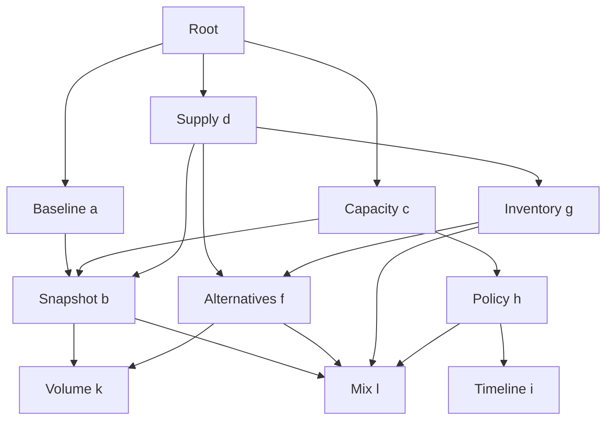

# Callable skill graph

A node is a function over explicit inputs and artifacts. The harness reads skill
prose, observes results and writes JavaScript programmatic tool calls (PTC).
Nodes can compose, run in parallel, share identical work and publish progress.
Deep Agents is an execution adapter; RLM, review and coherence are not core primitives.

**The runtime owns execution and artifact authority. Applications own meaning.**
A completed review can publish a failing verdict. Approval and bounded repair are
ordinary compositions, demonstrated in [examples/review.py](examples/review.py).
There are no review policies, reviewer roles or repair fields in the core contract.

## Native primitives that earn their keep

| Host endpoint | Why the host owns it |
| --- | --- |
| `readNode` | Bounded access to pinned procedure prose and links |
| `openNode` | Admission, shared execution identity and a caller-owned lease |
| `nextNodeEvent` | Ordered progress/completion, wait safety and delivered artifact grants |
| `closeNode` | Release one consumer; cancel/drain only after the last consumer leaves |
| `readArtifact` | Bounded immutable reads with explicit authority checks |
| `publishCheckpoint` | Immutable, replayable intermediate publication |
| `submitCandidate` | Final return channel across the agent/tool boundary |
| `runNode` | Final-only fast path: await one result without reading/granting all checkpoints |

Seven essential host operations plus one deliberate fast path. All are defined
once in [NodeAPI](harness/api.py) and exposed by both adapters. See the
[native PTC audit](docs/native-ptc-primitives.md) for the justification, derivable
operations, actual composition test and removed APIs.

Generated code normally uses the [shared wrapper](docs/ptc-wrapper.md):
`nodes.run(request)` for a final receipt, `nodes.with(request, callback)` for scoped
progress, and `nodes.open(request)` for work spanning eval cells. Functions,
`Promise.all`, branching, review and retries stay in ordinary code. No model-managed
lock/unlock tools or extra transformation language is needed.

## An actual converging graph



A and c can join one running b, while d later reuses its completed result. D and g
also converge on f; several procedures share k/l/delta work. Each caller keeps its
own interpretation. C can ask the same b skill a different question with its
measurement checkpoint as evidence, even while neutral b continues running.
Fresh audits and a thesis composition follow this investigation graph.

The [executed trajectories](#two-prompts-and-two-executed-trajectories) record every
caller edge and actual execution ID, including running joins and completed reuse.
They also record thesis → thesis_draft → artifact → red_team → decision.

## Explicit requests and shared work

```js
const snapshot = await nodes.run({
  node: 'b', task: 'Produce snapshot evidence',
  inputs: {current, previous, observations, units},
  refs: [], key: 'snapshot', reuse: 'session'
});
```

`reuse: "fresh"` is the default. Session reuse matches the exact task, canonical
inputs, ordered refs and sealed execution configuration. It starts absent work,
joins running work and reuses completed work. A negative domain decision is still
a completed result. A caller wanting another attempt uses a new key and `fresh`,
or changes the task/inputs/evidence to describe the different work.

The same caller/key always replays the original execution, including its error.
Conflicting use of a key is rejected. A new session request waits for cancelling
work to drain before replacement. Cancelling a does not cancel shared b while c
still holds a lease. The host checks active wait cycles and depth across branches.
See [shared operations](docs/shared-operations.md).

`publishCheckpoint` makes immutable progress available to current and late
subscribers. Publication does not approve its content. Callers inspect usefulness
and can invoke another transformation using explicit refs. A final-only `runNode`
grants only the final artifact; observing progress grants the delivered checkpoints.
Grants are non-transitive: a hash mentioned inside an artifact is not permission.

## Small contracts

| Concern | Representation |
| --- | --- |
| Procedure | `SKILL.md` with `name`, `description`, prose, links and optional resources |
| Executor | Host registration and skill-to-executor binding |
| Call | `node`, `task`, `inputs`, `refs`, `key`, `reuse` |
| Output | `summary`, application-defined `content`, `based_on` |
| Receipt | `ref`, `summary`, `status: "published"` |
| Domain approval | An application's decision artifact, never a runtime state |

The two frontmatter fields are a deliberately small local convention. Adding an
expertise or custom executor does not add attributes to all nodes. `[[b|text]]`
means a prose link to b with the label text; it does not specify a call or arguments.
Reading a skill records consultation and has no implicit publication obligations.
The [end-to-end design](docs/dynamic-skill-ptc-design.md) defines every layer.

The example thesis composition calls thesis_draft, runs a fresh red_team of the
exact candidate and can request one revision. It publishes an `approved` or
`blocked` decision; the root inspects it before reporting completion. The core
never interprets `verdict`, `decision` or `findings`. Raw candidate artifacts remain
available to callers with grants; product release decisions belong to the application.

## Two prompts and two executed trajectories

| Scenario | Prompt | Captured graph, PTC and observations |
| --- | --- | --- |
| A: parallel consumers | [Prompt A](examples/prompts/scenario_a.md) | [Trajectory A](examples/trajectories/scenario_a.md): a/c observe progress while b runs; c invokes a focused follow-up |
| B: baseline first | [Prompt B](examples/prompts/scenario_b.md) | [Trajectory B](examples/trajectories/scenario_b.md): c replays b's checkpoint after completion; policy reuses mix evidence |

These are **offline scripted fixtures through real Deep Agents and QuickJS**.
The model double selects prewritten PTC fragments from actual observations. The
traces verify execution behavior, not live-model code generation or reasoning quality.
In live mode the agent writes PTC from the [execution prompt](harness/runners/node_agent.md)
and skill prose. Only the arithmetic utility is an authored skill script.

## Run and verify

Python 3.11+:

```sh
python -m venv .venv
. .venv/bin/activate
python -m pip install -r requirements-dev.txt
python demo.py --offline --case a --trace outputs/scenario_a.json
python demo.py --offline --case b --trace outputs/scenario_b.json
python -m unittest discover -s tests -v
ruff check .
ruff format --check .
python -m examples.export_trajectories
```

Other fixture cases: `deferred` (c first requests b), `skip-c`, `a-diversified`,
`b-no-proposal`, `unchanged`, `incoherent` and `unsupported`. They exercise omitted
edges, late producers, failed audits and blocked synthesis. Tests cover sharing,
cancellation, cleanup, cycles, budgets, progress, arbitrary nested transformations,
exact-candidate approval/repair and both execution adapters.

For live generation, install the chosen LangChain provider integration, configure
credentials and run `python demo.py --case a --model provider:model-name`.
Live-provider behavior and KV-cache speedups have not been measured here. The
[edge-case/KV review](docs/edge-cases-and-kv-cache.md) separates local verification
from serving work that still needs measurement.

## Code map

| Location | Responsibility |
| --- | --- |
| `harness/contracts.py`, `skills.py` | Small request/output contracts and immutable prose packages |
| `harness/operations.py` | Atomic sharing, leases, cancellation draining and active wait graph |
| `harness/runtime.py`, `storage.py` | Contexts, access, budgets, publication and immutable records |
| `harness/api.py`, `runners/` | One capability definition, execution adapters and JS convenience wrapper |
| `examples/review.py` | Application approval schema and bounded composition |
| `examples/`, `skills/` | Converging graph, prompts, fixtures and trajectory exporter |
| `tests/` | Contract, concurrency and real-interpreter regression coverage |

`python tools/package_deliverables.py` packages source and docs. Coordination is
single-session and single-event-loop. SQLite persists artifacts/events; active
work is not durable. No cross-session cache, fuzzy task equivalence, external-effect
exactly-once guarantee or crash recovery is implemented. Call budgets are not
currency/token budgets, and fresh context does not establish independent judgment.
