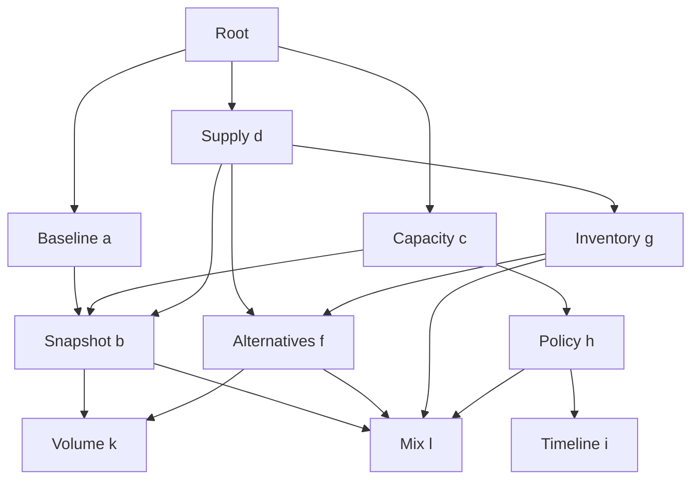

# Callable skill graph

The harness reads skill prose, observes results, and writes JavaScript programmatic
tool calls (PTC). Its `run_node` primitive can create an execution, join identical
running work, or reuse an accepted result. Deep Agents is one execution adapter.

A skill is a procedure. A caller's request is a use of that procedure. An execution
is the work producing an artifact. **Several callers can share one execution while
keeping their own interpretations and cancellation lifetimes.**

## An actual converging graph

This is the investigation portion of the authored graph. The root can run a and c
concurrently. Both reference b; d later revisits b. D and g also reference f, and
several procedures reference the same volume, mix and delta producers.



The delta utility is also shared by b/f/g/h. Fresh audits and synthesis follow the
investigation. The [executed trajectories](#two-prompts-and-two-executed-trajectories)
show actual execution IDs and every caller edge; the graph is not rendered by
pretending each execution has one owning parent.

In the recorded parallel scenario, **25 calls produce 17 executions**: two calls
join running work and six reuse completed results. There is one b, one f, one k
and one l execution. A and c produce separate interpretations of the same b artifact.
Their arrival order can vary; neither becomes the shared producer's exclusive owner.

## Shared work: start, join, reuse, release

```js
const b = await tools.runNode({ request: {
  node: "b",
  task: "Produce snapshot evidence",
  inputs: { current, previous, observations, units },
  refs: [],
  key: "snapshot-for-this-view",
  reuse: "session"
}});
```

| State of matching work | What this call does |
| --- | --- |
| Absent | Atomically create one execution and acquire a wait lease |
| Running | Acquire another lease and await the same execution |
| Accepted | Return the existing result and grant its ref to this caller |
| Cancelling | Wait for cleanup, then resolve/create the replacement |
| Failed, cancelled, or `needs_review` | A new caller/key may create a new execution |

Same caller/key always identifies the original request. Once bound to an execution,
an exact retry replays that execution, including its failure. An intentional new
attempt needs a new key. Conflicting use of a key is rejected, including while
waiting for cleanup.

`reuse: "fresh"` is the default. A fresh call does not join another caller's work.
Use it for independent reviews and work that must happen separately. Shared identity
includes the exact task, JSON inputs, ordered evidence refs, skill snapshot and
sealed execution configuration. Caller IDs and local keys are not shared identity.
Similar prose is not automatically judged equivalent.

The runtime owns wait leases and releases them on success, failure or cancellation.
Cancelling a releases a's wait on b; b continues if c still needs it. When the last
waiter leaves unfinished work, the runtime requests cancellation and drains cleanup
before permitting replacement. There are no model-managed mutexes or unlock tools.

The [shared-operation design](docs/shared-operations.md) covers atomicity, ownership,
retry generations, wait-cycle detection, depth bounds, and cancellation races.
This implementation coordinates one event loop in one session; it is not a
distributed lock service or durable orchestration engine.

## Clean contracts

| Concern | Representation | Owner |
| --- | --- | --- |
| Procedure meaning | `SKILL.md`: name, description, prose, links and optional resources | Skill author |
| Execution mechanism | Registered executor and skill-to-executor binding | Application |
| Mandatory publication checks | Required-review policy | Application |
| This caller's work request | node, task, inputs, refs, key, optional reuse | Calling agent or launcher |
| Running work and its consumers | Operation, caller/key binding, transient wait leases | Runtime |

Frontmatter still permits only `name` and `description`, a deliberately small local
convention. Links, resources and revisions are derived. No `shareable`, `lock`,
`critic`, model, tool-list or workflow attributes were added to skills. Different
expertise belongs in prose. Different backends belong in executor configuration.
The [end-to-end contract](docs/dynamic-skill-ptc-design.md) defines the public fields.

The example's shared producers describe standard neutral tasks in prose. Each caller
requests that exact work, then interprets the artifact for its own question. If two
calls genuinely ask different questions, their requests differ and they do not share.

## Two prompts and two executed trajectories

| Scenario | Prompt | Actual offline trajectory |
| --- | --- | --- |
| A: parallel consumers | [Prompt A](examples/prompts/scenario_a.md) | [Graph and PTC A](examples/trajectories/scenario_a.md): running b/f joins, later b/k/l reuse |
| B: baseline first | [Prompt B](examples/prompts/scenario_b.md) | [Graph and PTC B](examples/trajectories/scenario_b.md): c and d reuse completed b; policy reuses mix evidence |

These are explicit **offline scripted fixture runs** through actual Deep Agents,
QuickJS and the runtime. They contain prompts, execution graphs, call dispositions,
PTC and observations. The fixture selects prewritten fragments from real tool outputs;
it does not establish live-model code generation or reasoning quality. The shared
[execution prompt](harness/runners/node_agent.md) is checked in too.

## Run it

Python 3.11+:

```sh
python -m venv .venv
. .venv/bin/activate
python -m pip install -r requirements-dev.txt
python demo.py --offline --case a --trace outputs/scenario_a.json
python demo.py --offline --case b --trace outputs/scenario_b.json
python demo.py --offline --case deferred
python -m unittest discover -s tests -v
ruff check .
ruff format --check .
```

Regenerate both documents with `python -m examples.export_trajectories`.
The CLI reports calls separately from executions, plus join/reuse counts.

| Fixture | Behavior exercised |
| --- | --- |
| `a` | Parallel a/c consumers, common b, and converging f/k/l work |
| `b` | a completes before c; c/d reuse accepted b; h/i policy branch |
| `deferred` | a omits b; c is its first requester |
| `skip-c` | c's condition omits b; d still reuses a's result |
| `a-diversified` | Supplier observation does not justify f/g |
| `b-no-proposal` | No timeline node when no regulation is pending |
| `unchanged` | b omits k/l; h later creates l when it needs it |
| `incoherent` | Currency mismatch blocks synthesis |
| `unsupported` | Seeded unsupported claim blocks synthesis |

The concurrency suite uses events and barriers to force running/completed/cancelling
states, avoiding timing-based sleeps. It checks shared cancellation, draining before
replacement, conflicting retry keys, cycles across branches, depth after joining,
evidence access, fresh isolation and budgets. Fresh required-review repair and native
and PTC execution remain covered by the adapter suite.

## Where code comes from

In live mode, the agent inside the harness writes PTC from prose and observations:

```sh
python demo.py --case a --model provider:model-name
```

Install the selected LangChain provider integration and configure credentials.
Live-provider behavior remains untested by the offline suite.

| Code | Purpose |
| --- | --- |
| Model-written `eval` calls | Runtime orchestration, observations, joins, branches and transformations |
| `examples/scripted_model.py` and JS helpers | Clearly separate offline test double |
| `skills/delta_check/scripts/observe_delta.js` | Optional authored arithmetic utility; no orchestration decisions |
| `examples/application.py` | Executor bindings and mandatory review configuration |

Skill bodies contain prose, not executable orchestration programs. Shared execution
does not require a script in the skill; b/f/k/l are agent executions.

## Four host capabilities

| Capability | Effect |
| --- | --- |
| `readNode` | Inspect a procedure; `enter: true` also adopts its publication obligations |
| `runNode` | Run fresh work or acquire/join/reuse explicitly shared work |
| `readArtifact` | Read bounded slices of an authorized immutable record |
| `submitCandidate` | Stage an output for host validation and required reviews |

Native snake_case tools use the same API. A successful `runNode` grants the result
to its caller. Input refs are authorized before every shared acquisition, including
cache hits. Mentioning a hash inside content does not grant access, and grants are
not transitive. A review can be accepted with `content.verdict: "fail"`; publication
status and correctness are separate.

## Code map

| Location | Responsibility |
| --- | --- |
| `harness/contracts.py` | Request, candidate, receipt and context validation |
| `harness/skills.py` | Immutable prose/resource packages and strict loading |
| `harness/policy.py` | Application-owned required-review rules |
| `harness/operations.py` | Work identity bindings, atomic acquisition, leases, draining and active wait graph |
| `harness/runtime.py` | Execution contexts, access, admission and publication/review lifecycle |
| `harness/storage.py` | Immutable SQLite records and ordered events |
| `harness/api.py`, `harness/runners/` | Bound capabilities and execution adapters |
| `examples/`, `skills/` | The graph, prompts, fixture inputs, PTC and trajectory exporter |
| `tests/` | Contracts, deterministic concurrency and real-interpreter regression tests |

`python tools/package_deliverables.py` packages source and docs. SQLite persists
records and events; active work, leases, caller keys and budgets remain in memory.
There is no cross-session cache, automatic semantic equivalence, external-effects
gateway or crash recovery. Call budgets are not token/currency budgets, and fresh
context alone does not establish independent judgment.
