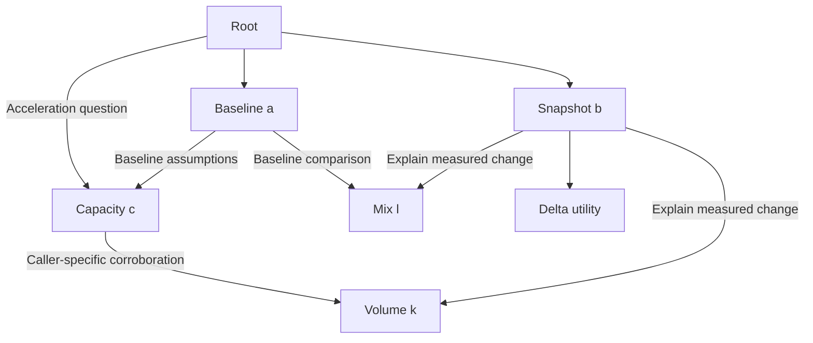

# Callable skill graph

The harness reads skill prose, observes results, and writes JavaScript programmatic
tool calls (PTC) during execution. A node invocation can call another node in fresh
context, including a red-team or coherence procedure. The primitive is `run_node`;
Deep Agents is one execution adapter.

A skill graph describes possible reuse. The executing agent chooses its calls,
tasks, branches and joins. **Adding an agent with different expertise means adding
prose, not adding attributes to a universal Node class.**

## Four separate contracts

| Concern | Representation | Who chooses it? |
| --- | --- | --- |
| What a procedure means | `SKILL.md`: `name`, `description`, prose and links; optional resources | Skill author |
| How a call executes | Registered executor and optional skill-to-executor binding | Application |
| What must pass before publication | Required-review policies | Application |
| What this particular call asks | `node`, `task`, `inputs`, `refs`, `key` | Calling agent or launcher |

The two frontmatter fields are a **minimal local convention**, not a proposed
universal skill standard. The loader rejects unknown or duplicate fields. Links,
resource lists and revisions are derived. There is no `library.kind`, `profile`,
`critic`, model field, tool list, embedded branch program or catch-all metadata bag.
The [design and migration document](docs/dynamic-skill-ptc-design.md) defines every
public field and explains where future extensions belong.

## Nested reuse, different questions

This is the reusable portion of the example's authored graph. Edges are prose
links, not commands the supervisor executes automatically.



Scenario A includes `root → a → c → k` and a separate `root → c → k`.
`b` also uses `k` and `l` after observing a changed snapshot. These calls use the
same skill definitions with different prose tasks and evidence. Each has its own
context, interpreter, artifact and recorded task. No result is implicitly reused
merely because its skill name or inputs match.

After observing `b`, root investigates `c`/`d` or `h`; observations from `d` or `h`
may lead to `f`/`g` or `i`. Fresh audits check direct branch outputs before synthesis.
`thesis` also has a mandatory review of its exact frozen candidate. A nested `c`
inside `a` is not a root-level acceleration investigation.

## Two prompts and two PTC trajectories

| Example | Task prompt | Executed trajectory |
| --- | --- | --- |
| A: accelerating demand | [Prompt A](examples/prompts/scenario_a.md) | [PTC A](examples/trajectories/scenario_a.md): repeated c/k, then d and f/g |
| B: stable demand | [Prompt B](examples/prompts/scenario_b.md) | [PTC B](examples/trajectories/scenario_b.md): baseline nesting, then h and i |

Both trajectories come from actual **offline scripted fixture runs** through Deep
Agents, QuickJS and the supervisor. They show complete invocation tables and
captured PTC/observations for root and nested a/b/c. They do not claim that an LLM
wrote those programs. The shared [execution prompt](harness/runners/node_agent.md)
is also checked in.

## Run it

Python 3.11+:

```sh
python -m venv .venv
. .venv/bin/activate
python -m pip install -r requirements-dev.txt
python demo.py --offline --case a --trace outputs/scenario_a.json
python demo.py --offline --case b --trace outputs/scenario_b.json
python -m unittest discover -s tests -v
ruff check .
ruff format --check .
```

Regenerate the two documented trajectories with
`python -m examples.export_trajectories`. The CLI requires an explicit execution
mode. Offline mode selects prewritten PTC from observed tool outputs, makes no model
API calls and does not interpret arbitrary prompt edits.

| Fixture | Behavior checked |
| --- | --- |
| `a` | Baseline nesting plus acceleration-specific c/d and f/g; reviewed thesis |
| `a-no-e` | No f/g after diversified-supplier observation |
| `b` | Baseline nesting plus h/i; no root-level c audit |
| `b-no-j` | No i when no regulation is pending |
| `unchanged` | b returns after delta; a's separate c/k/l calls still occur |
| `incoherent` | Joint audit finds currency mismatch; blocked report |
| `unsupported` | Red team finds a seeded unsupported claim; blocked report |

For actual model-written PTC:

```sh
python demo.py --case a --model provider:model-name
```

Install the selected provider's LangChain integration and configure credentials.
The live model receives prose and observations, then writes its own code. Offline
fragment templates are not imported in this mode. Live provider execution and
semantic quality have not been validated by the offline suite.

## Where execution code belongs

| Code | Purpose |
| --- | --- |
| Agent-written `eval` calls | Runtime orchestration, observation, transformation, branching and joins |
| `examples/scripted_model.py` and its JS helpers | Explicitly offline test double; prewritten trajectory fragments |
| `skills/delta_check/scripts/observe_delta.js` | Optional authored numerical utility; no orchestration decisions |
| `examples/application.py` | Chooses executors and required reviews; contains no semantic branch predicates |

The example application binds `delta_check` to a JavaScript resource executor.
That binding is outside frontmatter. All other example skills run through the
agent executor. Additional model/tool configurations belong to executor instances;
adding one does not change `Skill` or `NodeRequest`.

## Four host capabilities

```js
const procedure = await tools.readNode({ node: "c" });
const receipt = await tools.runNode({ request: {
  node: "c",
  task: "Assess whether capacity can meet accelerating demand",
  inputs,
  refs: [demandEvidence.ref],
  key: "capacity:acceleration"
}});
if (receipt.status !== "accepted") throw new Error("Child requires review");
const slice = await tools.readArtifact({ ref: receipt.ref, limit: 4000 });
// Continue reading slices if next_offset < total_chars.
await tools.submitCandidate({
  summary: "Capacity assessment received",
  content: { assessment: receipt.ref },
  based_on: [receipt.ref]
});
```

Reading a skill does not run it. `readNode({node, enter: true})` adopts its procedure
and required-review obligations in the current frame. `runNode` starts a fresh
invocation and returns a reference, status and summary. The snake_case native tools
use the same API; the framework's legacy `task` route is also supervised.

All invocations can read their own outputs and explicitly granted references.
Child receipts grant their result to the caller; passing refs grants them to the
child. Grants are not transitive. An accepted reviewer artifact can contain a
`fail` verdict; always inspect its content. Acceptance is a publication status,
not a truth claim.

## Code map

| Location | Responsibility |
| --- | --- |
| `harness/contracts.py` | Call, candidate, receipt and run-context contracts; JSON validation |
| `harness/skills.py` | Immutable prose/resource packages and strict loading |
| `harness/policy.py` | Host-owned required-review rules and cycle validation |
| `harness/runtime.py` | Invocation lifecycle, grants, admission, joins and review rounds |
| `harness/storage.py` | Immutable SQLite records and trace events |
| `harness/api.py` | Four frame-bound capabilities |
| `harness/runners/` | Fresh Deep Agents, resource execution and inference metering |
| `examples/` | Host wiring, inputs, prompts, explicit offline model and trajectory export |
| `skills/` | Reusable prose graph with one optional utility resource |
| `tests/` | Contract, lifecycle, schema, adapter and end-to-end regression tests |

`python tools/package_deliverables.py` packages current source and docs. Obsolete
root modules and earlier conflicting design documents were removed; Git history
retains them. CI checks formatting, lint, dependency consistency and behavior.

This remains a single-process reference: records persist in SQLite, but execution
state does not recover after a crash. There is no cross-session cache, production
effects gateway or OS shell backend. Call-count budgets are not token/currency
budgets. Fresh context does not prove independent judgment. See the design document
for the remaining limitations and the conditions under which this abstraction fails.
