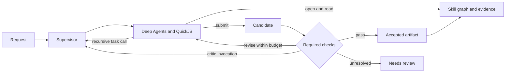

# The Library Harness Design

Skill graphs with programmable recursive execution

Architecture and reference implementation for the Library team

13 September 2026

## 1 Recommended architecture

Keep the skill graph as the system's knowledge and execution-contract layer. Use Deep Agents as the agent engine and its QuickJS interpreter as the programmable context environment. Add a small supervisor that owns invocation identity, capability limits, resource admission, artifact publication, and required review. The model writes the decomposition and aggregation program. The supervisor enforces the contracts at skill entry and result acceptance.

The recursive primitive is a bounded computation over a skill, objective, binding inputs, and selected evidence references. Every call uses the same contract, whether it comes from a user request, JavaScript, another worker, or a required critic. Results return as small receipts. Large evidence and intermediate outputs stay in interpreter variables or immutable storage until a model deliberately inspects a slice.

This retains the defining idea of the Library: linked expertise informs what to do next, and entering a node supplies the relevant context. It also adopts the runtime review's strongest simplification: there is one general worker implementation, rather than one registered agent per skill. The harness does not interpret ordinary links as a mandatory workflow or prescribe depth-first search.

Automatic red-teaming requires a deliberate revision to v1.2. A reviewed skill may declare a bounded review contract. A generic supervisor executes that contract and prevents an unreviewed candidate from being accepted. The critic's substantive reasoning remains in a skill. This small amount of enforced lifecycle logic is justified by the requested guarantee.

The proposed design combines current techniques, but state-of-the-art performance is a hypothesis to test. No architecture alone establishes that result. The included implementation verifies runtime behavior with scripted models; the evaluation section specifies how to test quality and economics with real models.

## 2 Decisions relative to the two documents

The v1.2 specification supplies the skill graph, context-entry semantics, recursive workspaces, and inner/outer memory contract. The runtime review supplies the separation between portable knowledge and execution services, code-driven aggregation, immutable publication, and bounded supervision. Their recommendations are design evidence, not instructions that override this revision.

| Prior choice | Decision in this design | Reason |
| --- | --- | --- |
| Skill graph with authored links | Retain | It preserves reusable expertise and cross-cutting context. |
| No domain DAG executor | Retain | Generated programs choose order, branching, and joins. |
| Context enrichment is optional | Require it at explicit node entry | Graph entry is central to the requested behavior. |
| One registered specialist per skill | Avoid | A generic worker receives a skill contract dynamically. |
| Return child artifacts in full by default | Replace with receipts and bounded reads | Fan-out should not fill the parent's transcript. |
| No review choreography in the harness | Replace with a generic bounded review protocol | A required check cannot depend on the writer remembering it. |
| Workspace filename matching determines reuse | Replace with indexed provenance and eligibility filters | Skill names alone do not establish matching scope or freshness. |
| Entry under a system path grants maintenance access | Replace with authenticated launch authority | A chosen path must not grant additional permissions. |
| Inner agents propose memory and humans govern skills | Retain | Experience and governed procedure need different write controls. |

The graph is valuable when a procedure has reusable neighbors: a sizing workflow can consult liquidity, volatility, and currency expertise without copying those procedures into each branch of a directory tree. A directory hierarchy still provides packaging and discovery. Links provide cross-cutting relationships. This need not introduce a graph database: Markdown plus a compiled adjacency index is enough initially.

The main architectural risk is spending more on navigation than it saves. One-hop retrieval, explicit budgets, and a files-only baseline keep that measurable. Do not reward the system for following a preferred traversal when another route produces a better answer.

## 3 What current Deep Agents actually provides

The checked Python release is `deepagents==0.7.13`; its optional QuickJS dependency requires at least 0.3.5. The reference pins `langchain-quickjs==0.3.5`. Live documentation gives a broader minimum interpreter version, so the released package metadata and inspected wheel are the implementation authority for this adapter. [Deep Agents release](https://pypi.org/project/deepagents/0.7.13/)

Dynamic subagents dispatch configured workers through JavaScript `task({description, subagentType, responseSchema?})`. Each dispatch runs an agent loop. Code can branch, launch batches, and combine results. Dynamic does not mean that an agent can invent new authorized roles, tools, or permissions. The documented interpreter facility is beta. [Dynamic subagents](https://docs.langchain.com/oss/python/deepagents/dynamic-subagents)

| Capability | Upstream behavior | Library integration |
| --- | --- | --- |
| Programmatic agent calls | Interpreter task bridge | Register one supervised compiled worker. |
| Programmatic tools | Explicit PTC allowlist | Expose scoped graph, artifact, and candidate functions. |
| Recursive calls | Depend on the configured runnable | Build each invoked worker with the same adapter. |
| Skill discovery | Progressive skill loading | Keep a stable catalog and add graph-aware entry. |
| Fresh delegation | Isolated task context | Default for ordinary recursive calls. |
| History fork | Experimental inherited conversation mode | Optional continuation worker, separately evaluated. |
| Interpreter state | Thread, turn, or call modes | Use thread state as working memory, artifacts for durability. |
| Completion and persistence | Agent execution and graph state | Host determines accepted publication and terminal status. |

The released subagent code accepts a public `CompiledSubAgent` runnable and requires a messages result. It rejects a dynamic response schema for compiled workers. The adapter therefore returns fixed JSON receipts, omits `responseSchema`, and parses the returned string in a small JavaScript helper. Declarative fork workers refuse further task delegation; unrestricted recursive history forks are not assumed. [Subagent implementation](https://github.com/langchain-ai/deepagents/blob/fc91199a44b99990cca49341169aea858da222fc/libs/deepagents/deepagents/middleware/subagents.py)

The graph constructor does not universally copy arbitrary parent middleware into the default general-purpose worker. It also accepts an explicitly supplied general-purpose worker in place of its default. We use that supported replacement and explicitly construct the Library behavior for every frame. LangGraph's step recursion limit remains separate from semantic child depth and global call budgets. [Graph constructor](https://github.com/langchain-ai/deepagents/blob/fc91199a44b99990cca49341169aea858da222fc/libs/deepagents/deepagents/graph.py)

PTC tools and interpreter task dispatch bypass the parent's normal ToolNode approval path. Allowlisting therefore grants a real capability. The interpreter supports bounded output and persistence, but restored variables do not undo external effects or establish durable job recovery. Use execution isolation appropriate to the deployment and enforce effects at their host implementation. [Interpreter documentation](https://docs.langchain.com/oss/python/deepagents/interpreters)

## 4 The runtime boundary

There are four application operations. They need not become four new conversational tools. Three are PTC functions; recursive calls use Deep Agents' native task bridge. The engine's existing filesystem and other tools remain part of the actual capability surface, so the design makes no claim that one visible interpreter tool means one capability.

| Operation | Contract | Owner |
| --- | --- | --- |
| open skill | Load authored procedure, bounded notes, and eligible linked results; activate obligations | Context service |
| read evidence | Return an authorized bounded slice with provenance | Artifact service |
| rlm call | Admit and run a fresh supervised computation; return a receipt | Invocation supervisor |
| submit candidate | Stage output for validation and required review | Publication service |

```javascript
async function rlm(request) {
  const raw = await task({
    subagentType: "general-purpose",
    description: JSON.stringify(request)
  });
  return typeof raw === "string" ? JSON.parse(raw) : raw;
}
```

The request contains `skill`, `task`, `inputs`, a stable operation `key`, and optional evidence `refs`. It never contains authoritative parent IDs, a trusted role, credentials, or a requested permission increase. Those values come from the invoking frame's host binding. A malicious or mistaken request cannot create an outer-loop identity by naming a maintenance skill.

The supervisor composes five reusable services: registry/context retrieval, execution admission, inference/tool gateways, immutable artifacts, and a lifecycle journal. Start with in-process implementations where adequate. Use the same interfaces for remote worker processes later. Minimality means keeping these responsibilities small and explicit, rather than removing necessary controls.

The supplied `architecture.mmd` shows the invocation, review, and memory paths. The model's working program defines task dependencies. The resulting invocation tree and artifact dependency graph are recorded observations of execution, not a predeclared domain DAG.



## 5 Skill graph contract

Keep expertise in ordinary `SKILL.md` files, with scripts and references nearby. Use canonical skill IDs independent of display titles. Compile frontmatter and links when a reviewed repository revision is loaded. Reject duplicate IDs, invalid paths, broken required links, incompatible output contracts, and invalid review policies before a session starts.

Ordinary wikilinks remain semantic references. They mean that another procedure may be useful; they do not imply automatic execution. Additional metadata should express only what the host must enforce. Start with review requirements, output validation, permitted execution profiles, and freshness rules. Add required evidence contracts only for constraints that genuinely must block acceptance.

```yaml
---
name: decision
description: Synthesize a decision from independent evidence
library:
  ttl_seconds: 3600
  review:
    critics: [counterexample-review]
    max_revisions: 1
---
# Decision
Consult [[evidence-check]] for supporting evidence.
Retain binding inputs and disclose unresolved uncertainty.
```

This is a proposed Library frontmatter extension, not a Deep Agents schema. The core ignores domain meaning in the prose. The critic itself is another skill, with an execution profile that cannot mutate the candidate or waive the producer's review policy. The reference forbids review contracts on critic skills to avoid infinite review-of-review chains. Critics may still make ordinary bounded research subcalls.

A production policy can also name registered deterministic validators, a response schema, or required evidence fields. Validator identifiers must resolve to host-approved implementations. Do not execute arbitrary code strings taken from skill metadata inside the supervisor.

Opening a skill inline activates that skill's review obligations for the current frame's output. Calling it recursively activates them for the child. A list of available links is discovery, not entry. A scope that needs separate outputs or incompatible procedures should use separate calls. Obligations accumulated within a frame cannot be removed by a later navigation. The smallest allowed revision limit among its active review policies applies.

Raw file reads cannot reliably provide this guarantee: a shell can read a skill without calling a recognizable tool. In the supplied adapter, governed skills are available through the graph service, while filesystem tools operate on scratch. If a deployment also permits raw source reads, document those as consultation and require explicit activation before claiming a governed skill result. Do not infer activation by parsing arbitrary shell code.

## 6 Context injection and retrieval

Every root or child entry uses the same context builder. Pin a knowledge revision, scope identity, relevant data snapshot identifiers, and memory revision when the session starts. An entry packet contains the authored skill, a companion note, explicitly linked notes, candidate receipts from linked skills, and unresolved links. Preserve the skill's authored content; attach dynamic material separately.

The graph narrows retrieval first. Within the session's authorized snapshot, look for accepted artifacts from the one-hop outbound neighbors. Filter by input compatibility, producer revision, source snapshot, freshness, output schema, and access scope before ranking candidates. Rank eligible results for relevance and recency. Similarity can help find useful evidence; it must not override an input or authorization mismatch.

For example, a result calculated for a US equity universe at one timestamp is not automatically reusable for Japan or for a later data snapshot. A summary should carry the binding scope and conclusion. When uncertain, return it as explicitly non-reusable background or omit it and expose the missing dependency. Never silently label it as a current result.

The reference uses exact equality of the full input object, matching session and skill snapshot, an accepted status, and a TTL. That is intentionally conservative. Production skills can declare a reviewed projection of the inputs that determine reuse. The projection's own version belongs in the fingerprint. Source corrections require invalidation or a new source snapshot even if the requested as-of date stays the same.

Use a total token budget, not only a per-note line limit. Reserve space for the active procedure and mandatory constraints. Pack notes and summaries until the remaining budget is reached; expose omitted counts and continuation references. A hundred individually small notes can still exhaust context. The reference bounds characters and rejects an oversized core procedure instead of truncating an obligation. A production adapter must count the actual model's rendered tokens.

Context injected into an interpreter variable is available to the program, not automatically understood by the model. On initial entry, the adapter sends the bounded packet with the objective. On inline entry, the generated program should expose the required procedure and selected observations in a bounded output. Large evidence stays external. Required checks remain registered even if the writer fails to inspect the material.

Sibling publication updates the artifact index atomically. A parent can refresh entry context or query selected references after its join. Do not rewrite old transcript messages, silently inject into every running sibling, or claim that a node itself owns conversational state. Context belongs to invocation frames; the graph defines which knowledge and result candidates are relevant.

## 7 RLM execution and recursive workers

The original recursive language model approach externalizes the working input and uses generated programs to inspect and decompose it. The transfer here is an external context environment plus recursive inference over selected slices. This does not require adopting the research implementation wholesale or treating its experimental results as results for the Library. [Recursive Language Models](https://arxiv.org/abs/2512.24601)

The preferred primitive is an agent call because a skill may need tools, retrieval, further decomposition, and review. A future `query` profile can serve short extraction or classification jobs with a single model completion and no delegation. It should use the same identity, budget, result, and provenance contracts. Add it only if measurements show that full agent loops impose material overhead on those workloads.

The parent decides whether to recurse, which skill to use, and how much context to pass. A child starts with its objective, pinned procedure, binding inputs, selected references, and a fresh interpreter. It does not inherit the parent's entire transcript, mutable REPL, scratch namespace, or maintenance authority. Accepted artifacts can be shared without copying conversation histories.

```javascript
const settled = await Promise.allSettled(
  slices.map((slice, i) => rlm({
    skill: "evidence-check",
    task: `Assess the evidence in slice ${i}`,
    inputs: scope,
    refs: [slice.ref],
    key: `evidence:${i}`
  }))
);
const accepted = settled.filter(x =>
  x.status === "fulfilled" && x.value.status === "accepted"
).map(x => x.value);
```

Here `slices` and `scope` are data already obtained by the workflow. The program preserves coverage and errors; it does not quietly discard failed items and claim complete analysis. A parent can inspect only disputed children and calculate numeric aggregates without another model call per result. This is the benefit of programmatic tool calling: data transformation happens before material enters the model context. [Programmatic tool use](https://www.anthropic.com/engineering/advanced-tool-use)

`Promise.all` and `allSettled` return arrays in input order. Completion-order delivery requires an explicit stream or queue. Keep deterministic result order for aggregation and emit completion events separately for progress. Do not confuse concurrent initiation with guaranteed simultaneous execution: host admission, provider limits, and interpreter bridge capacity still constrain it.

Use a global frame cap, semantic depth cap, operation budget, bounded branch batches, and a shared deadline. Detect repeated active subproblems using skill, objective, inputs, and references. Re-entering the same skill with a smaller problem is valid. A graph cycle alone is not an error; an unchanged recursively active request is. Keep required review calls in the same ledger and reserve enough capacity for them where acceptance requires their completion.

Each worker can be built lazily when its call is admitted. Registering the dispatch closure does not recursively construct another worker. This avoids building an infinitely nested agent configuration while still making the same supervised call available at every runtime depth.

## 8 Required red teaming and revision

The review protocol belongs to the supervisor because its completion must be enforceable. Its domain-specific critique and repair guidance belong to skills. The writer can request additional exploratory critique in code, but only host-recorded required checks satisfy an acceptance contract.

The lifecycle is `running -> candidate -> checking -> accepted`. Findings can lead back to `running` with a new revision. Missing evidence, unavailable critics, exhausted revisions, or contradictory unresolved findings lead to `needs_review`. Failures and cancellations have separate terminal events. An artifact with unresolved review is still useful work, but cannot masquerade as an accepted dependency.

1. Stage an immutable candidate and validate its envelope, declared output schema, and evidence references.
2. Freeze the active skill policies and candidate identity for this review round.
3. Run deterministic checks first when configured; distribute the exact candidate to fresh critic frames.
4. Collect structured findings with candidate identity, severity, claim, evidence, and a reproduction or counterexample when applicable.
5. Evaluate host-defined acceptance rules. Return the findings to the producer if a revision remains.
6. Stage a new candidate, recompute the applicable obligations, and rerun the required checks on that candidate.
7. Publish an accepted receipt only when all mandatory conditions pass; otherwise publish the explicit unresolved status.

The reference requires a correctly bound `candidate_ref`, a recognized verdict, and no unresolved findings to pass. It demonstrates one repair followed by a new review. Its structural checks do not establish that the critic's findings are true. Production validators should verify evidence existence and scope, execute domain tests where possible, and distinguish inability to verify from a supported failure.

Do not use majority agreement as proof. Several agents may share the same blind spot, especially when they use the same model, prompt, and evidence. Give critics independent access to source material, vary the failure hypotheses, and use different evaluation methods when justified. Keep severity and evidence visible; a single confirmed blocking counterexample can outweigh several passes.

Reviews must reference the exact candidate revision. A pass for a prior draft is not valid after a repair. Reviewers receive only the candidate and authorized evidence, not the writer's private rationale or other reviewers' conclusions by default. Do not allow a reviewer to edit a candidate in place. Stop early on unchanged drafts or repeating unresolved findings when that saves cost without bypassing required checks.

## 9 Supervision and operational guarantees

The authoritative frame carries session and parent identity, authenticated principal, capabilities, pinned snapshots, a deadline, a budget reservation, scratch location, and artifact grants. Capability inheritance is an intersection of the parent's grants, the deployment profile, and applicable skill restrictions. A skill may request an available capability but cannot grant itself one.

Put admission before billable work. A distributed deployment needs a shared atomic ledger that reserves a conservative maximum for input, output, reasoning, and tool costs. Reconcile against actual usage and release unused reservation. Include retries, summarization, embedding calls, critics, and provider-side auxiliary requests. Configure retry behavior explicitly. Post-hoc usage logs alone do not enforce a hard spending bound.

Concurrency permits should cover active provider operations, not whole frames. A parent waiting on children must not occupy the last model slot they require. Separately bound the total number of waiting frames and queued tasks so this scheduling rule cannot produce unbounded memory growth. Apply fair admission across branches and tenants. The reference verifies recursive execution with one model slot, but is an in-process count ledger rather than a currency budget service.

Interpreter timeouts must accommodate awaited agent calls. The upstream default five-second evaluation timeout is not an appropriate assumption for a multi-minute agent workflow. Choose a workflow deadline and bridge timeout together. For long jobs, use a submit-and-collect protocol with durable job handles; cancelling or restoring a REPL should not create ambiguous remote work. Test cancellation of the actual network request and worker process, not only the Python task.

Use a stable operation key scoped to the parent frame. Identical retries return the same job or receipt; reusing a key for different work is an error. Cross-parent artifact reuse is a separate provenance decision. For restart recovery, persist admission, request fingerprints, lifecycle transitions, and effect receipts in a transactional journal. Interpreter snapshots and LangGraph checkpoints do not make external actions exactly once.

Consequential effects belong behind an action gateway with actual authorization, idempotency, and any required user approval. The policy applies identically whether an action comes from PTC, a native tool, a shell helper, or a child. Do not depend on the parent `interrupt_on` setting to cover interpreter dispatch. Keep provider credentials outside model-controlled execution and put the entire worker in an appropriate process or container boundary.

## 10 Artifact publication and provenance

Separate writable scratch from immutable published records. A writer submits a candidate; the host stamps identity, validates references, records reviews, and publishes status. A normal agent completion without a candidate is a failure of the output contract. Required publication must not depend on extracting an arbitrary final conversational sentence.

An artifact envelope records identity, status, producer frame and parent, primary skill, all activated skill revisions, binding inputs, source snapshots, creation and validity times, summary, content references, dependencies, and review receipts. Large content belongs in immutable blob storage. A compact indexed manifest supports context retrieval. Content hashes identify exact versions; they do not by themselves establish truth, freshness, permission, or semantic equivalence.

Within one host, SQLite can atomically commit a record and index update. At larger scale, write the immutable blob first and transactionally publish a manifest referencing it. Readers only see committed manifests. Use conditional writes to prevent overwrite and reconcile orphaned blobs after interrupted publication. A partially written file must never appear as an available result.

Accepted artifacts are candidates for authorized session reuse. Drafts are private to their producing frame and explicitly granted reviewers. A child returns a receipt with an explicit status; its parent gains the right to inspect the returned unresolved result without making it generally reusable. Cross-session reuse requires a separate authorization and validity decision.

Keep raw retrieved text and memory marked as evidence. Instruction authority comes from the runtime and governed procedures under the user's request. An artifact can establish what was observed in a run but cannot override permissions or turn its embedded instructions into policy. An accepted label records protocol completion, not universal correctness.

## 11 Memory and the outer loop

Retain the two-loop model. Workflow sessions can propose attributed observations with a falsifiable claim, skill scope, evidence references, and a review date. The host validates and appends them. These proposals should be callable from code or staged for automatic commit, rather than requiring a conversational tool turn for each record.

Maintenance sessions use the same agent runner with a separately authenticated service identity. A scheduled consolidation job reads eligible observations, preserves evidence and scope while deduplicating claims, writes a new note revision, and records which observations were consumed. Update the note and its consumption ledger transactionally so a retry does not double-count evidence. Keep contradictory observations visible until resolved.

Use a total injection budget for notes, evidence-retention rules, expiration, and rollbackable note revisions. Distillation must preserve uncertainty and avoid converting a frequent preference into a universal instruction. Workflow agents cannot read the raw observation store through their ordinary memory interface or directly edit consolidated notes.

Skill reflection produces a proposal containing the diff, evidence, expected change, evaluation results, and rollback target. Human review remains the path into governed skill revisions. Naming an entry under `_system` does not grant write access; the launcher verifies that the authenticated caller may use the maintenance profile. This also applies when a workflow agent tries to invoke a maintenance skill as a child.

Publish knowledge changes as a new snapshot. Existing sessions keep their pinned snapshot unless an explicit rebase is recorded. New sessions receive the updated graph and notes. Evaluate memory chronologically to prevent future observations from leaking into earlier benchmark tasks.

## 12 High level implementation

The supplied package has a framework-independent kernel and a small Deep Agents adapter. The kernel implements explicit graph entry, recursive admission, immutable candidates and accepted records, mandatory reviews, cancellation, input-filtered reuse, and a count ledger. The adapter supplies one compiled dispatch target, three PTC functions, and a metered model proxy.

```python
# Application wiring; model selection is deployment configuration.
kernel = Kernel(registry, store, ledger=shared_ledger)
kernel.runner = DeepAgentRunner(kernel, model_factory)

receipt = await kernel.call(Call(
    skill="decision",
    task="Assess the supplied evidence",
    inputs={"as_of": "2026-09-13", "scope": "example"},
    key="root"
))
```

Inside the adapter, the configured `general-purpose` entry is a `CompiledSubAgent` backed by `RunnableLambda`. Its closure carries the current host frame. It parses the task request and invokes the kernel. Both native `task` and interpreter `task()` reach it. Each admitted child builds a fresh agent with its own middleware and the same dispatch contract. No private Deep Agents API is imported.

The PTC functions return native dictionaries for programmatic processing. The compiled task result is serialized through Deep Agents' result path, so the helper parses the fixed receipt when needed. `librarySubmit` only stages a candidate. The kernel, outside the model loop, controls validation, revision, and acceptance. The root follows the same rule as children.

The adapter deliberately uses `StateBackend` for private scratch. It does not pretend that independent state-backed files form a concurrent shared POSIX workspace. Shared knowledge and artifacts are accessed through the host services. A deployment can add a real sandbox backend without changing the graph and publication contracts.

Provider metering belongs below all model-using paths. The reference proxy counts model operations, including those made through that proxy for summarization. It is tested with scripted chat models. Before using a real provider, verify tool binding, structured output, streaming, usage metadata, retry accounting, and prompt-caching behavior. A wrapper can change provider detection or omit metadata even when ordinary invocation works.

## 13 End to end execution example

A user asks for a decision based on several evidence bundles. The launcher authenticates the request, pins the graph and input snapshot, admits a root frame, and enters the decision skill. Its entry packet identifies the evidence-check neighbor and activates a required counterexample review.

The root's interpreter divides the bundles into independent slices. It dispatches evidence-check calls through the native task bridge, supplying scope and immutable references. One child discovers two independent contradictions and makes narrower calls of its own. Their results remain outside the root transcript. The host applies the same accounting and publication rules at each level.

The root joins receipts, refreshes relevant context, and inspects the flagged evidence. It calculates coverage in code, makes a synthesis, and submits a candidate. If a necessary branch failed, it records the coverage gap rather than fabricating its result. The host validates dependency references and opens a fresh counterexample-review frame with access to the exact candidate.

The reviewer identifies a scope mismatch. The host records the finding and asks the producer for a revision. The producer changes the claim and evidence selection, then submits a new candidate. Prior passes are discarded. The new required review passes and the host publishes an accepted artifact with its dependency and review receipts.

The root returns the answer plus the accepted receipt. A useful observation about the scope mismatch can be proposed for later consolidation. An authorized maintenance session may turn it into an evidence-backed note. A human-approved skill change is needed if the workflow procedure itself should change.

If the critic is unavailable, a budget expires, or the mismatch remains after the allowed repair, the published result is `needs_review`. The parent and user can inspect it, but a downstream consequential action cannot treat it as an approved result.

## 14 Evaluation and rollout

Compare the proposed layers under matched models, tool access, evidence, output contracts, and total resource allowances. Start with a files-and-code baseline, then add ordinary delegation, graph entry, PTC, recursive calls, and required reviews. Add an otherwise equivalent hierarchy-based skill baseline to isolate the value of cross-links. Use ablations rather than changing every component at once.

| Experiment | Primary question | Measurements |
| --- | --- | --- |
| Graph entry versus files only | Does nearby context improve decisions? | Correctness, missed constraints, navigation cost |
| Graph versus hierarchy | Do links outperform directory discovery? | Discovery recall, duplicated work, accepted quality |
| PTC versus conversational tools | Does external aggregation save resources? | Input tokens, latency, provider cost, coverage |
| Recursive versus flat workers | Which tasks benefit from depth? | Quality by depth, branch count, wall time |
| Required critique versus none | Does review find real errors economically? | False positives, false negatives, correction yield |
| Fresh versus forked context | When is history worth carrying? | Accepted-result cost, lost constraints, cache usage |
| Memory on versus off | Do prior observations improve later work? | Chronological quality, stale beliefs, poisoning failures |

Use tasks that expose the architecture's failure modes: long evidence bundles, independent batches, diamonds with reusable intermediate results, repeated skills with different inputs, cyclic skill links, stale data, contradictory sources, inaccessible evidence, prompt injection in retrieved content, critic outages, partial publication, and cancellation during fan-out.

A traversal trace is not the grading target. Grade outputs against independently checked evidence, executable tests, or blinded human judgments. Record actual input/output usage and provider cost per accepted result, latency percentiles, artifact reuse errors, omitted constraints, and the fraction of critiques that caused a valid correction. Report uncertainty across tasks and repeated runs. A more expensive correct answer may be worthwhile; a higher review-pass rate alone is not improvement.

Measure prompt caching separately from artifact reuse. Keep tool definitions and core instructions stable within an authorized profile, but verify the final provider request. Identical skill text following different transcript prefixes does not imply an independent reusable cache block. Fresh workers remain the default until inherited context shows a quality or cost advantage in the chosen workload.

Roll out in stages. First deploy explicit entry, immutable publication, and the shared native/interpreter dispatch contract behind tests. Then add bounded required reviews and domain validators. Add semantic retrieval only when exact graph retrieval misses useful context. Enable maintained memory after enough evidence exists to evaluate it. Introduce distributed recovery and durable long jobs before depending on unattended production execution.

Keep the provider/model adapter replaceable. The durable investment is the reviewed skill graph, scoped evidence, and trustworthy execution contracts. Adopt a new agent engine when measured improvements justify the integration cost.

## 15 Verification and implementation limits

The implementation has offline unit tests for parallel recursive joins with one inference slot, review repair and candidate rebinding, malformed or missing review failure, inline review activation, scope/freshness/status filtering, bounded context, idempotent calls, cycle/depth limits, global call admission, cancellation propagation, deadline expiry, artifact access, and review-cycle rejection. Integration tests exercise real Deep Agents and QuickJS with scripted models through both native and interpreter dispatch.

The checked suite passes 16 tests. The real-interpreter tests include a three-level root/child/grandchild chain, a native task dispatch, and a rejected candidate that is repaired and accepted after a second independent review invocation. All inference responses in these tests are scripted; the framework, interpreter, task bridges, and supervisor execute normally.

These tests establish behavior of the tested local paths, not live-model quality. No provider API calls, financial decisions, production credentials, or workplace deployment were used. The package is a high-level executable reference. It is not a ready-made distributed production service.

SQLite stores immutable records and events, but the reference does not recover active frames, grants, job keys, or budgets after restart. It does not implement distributed reservations, source-update invalidation, OS sandboxing, external action approval, domain validators, a long-running job service, or outer-loop maintenance. Those are specified integration boundaries. The registry assumes trusted reviewed inputs; production ingestion needs full schema validation and authorization.

The reference's model limit counts operations, not tokens, currency, or internal SDK retry attempts. Its retrieval scans stored records and uses character budgets; production needs indexed pagination, source-aware eligibility, and model-token accounting. Required reviewer calls consume the same limits and can produce an unresolved result if resources run out. A production scheduler should reserve review capacity during admission.

The critical acceptance condition for deployment is that interpreter calls cannot bypass the same identity, budgets, action authorization, and publication checks applied to native calls. If an integration cannot demonstrate that condition, keep it on the supported path until it can. This is an implementation requirement, not an argument to abandon PTC or the skill graph.

## 16 Source and reproducibility notes

Primary documentation, the released wheels, and relevant implementation files were checked on 13 September 2026. Current upstream main was also inspected at commit `c08cae693e0036fcd45d979a7dfa3a7e306a0515`; the adapter is pinned to released packages rather than relying on changes only present on main.

| Released artifact | SHA256 |
| --- | --- |
| deepagents 0.7.13 wheel | d717ee8ee092a91c475a6124ed578d5e4154d54120769a1081bfe1aece87c248 |
| langchain quickjs 0.3.5 wheel | 288b276ea7dcc3cfac2b84b7fed1079ac076e1c682bc3e4e2c2ce31d20ea2d2c |

The installed dependency freeze is supplied with the code. The original inputs are the pasted Library v1.2 system design and `library-runtime-review.docx`, titled A Minimal Runtime for the Library. The former defines the graph and memory contracts; the latter's recommendations were reconsidered against the current request and checked APIs.

The linked Deep Agents pages support the upstream capability descriptions. The Library operation names, policy schema, lifecycle, retrieval rules, and supervision architecture are recommendations implemented or specified here. The RLM paper motivates external context and recursive computation; it is not evidence that this harness has reached the paper's benchmark results.
