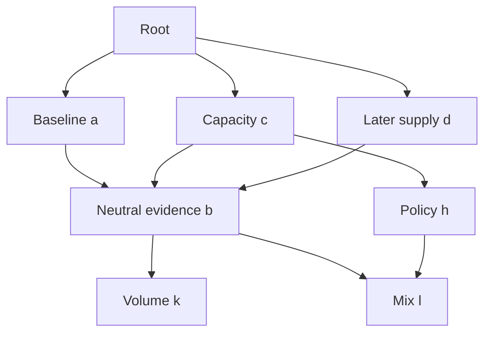

# Composition patterns with the current API

These patterns use the implemented NodeRequest and PTC surface. All calls include a
caller-local key. Explicit session reuse is necessary when separate calls should
share work. Review verdicts and decision schemas below are application examples,
not runtime attributes. See [runtime.md](runtime.md) for authority and cleanup.

## 1. Request construction and artifact reads

An ordinary helper makes simple transformations readable without extending the host:

```js
const invoke = (node, key, task, receipts = [], inputs = {}, reuse = 'fresh') =>
  nodes.run({node, key, task, inputs, refs: receipts.map(value => value.ref), reuse});
```

Keys should identify logical attempts within the caller. Repeating one with different
arguments is rejected. A loop normally includes its attempt number in the key.
Passing a receipt's ref grants that artifact to the child, not all records mentioned
inside it. Unknown helper names such as `artifacts.read`, `publish`, `submit`, and
`memory.read` are not installed aliases.

`tools.readArtifact` returns a slice, not a parsed object. Parse only after collecting
all slices within an application budget. For example, this local helper caps material
at 100,000 characters (choose a smaller bound for model context when appropriate):

```js
async function readRecord(receipt) {
  let text = '', offset = 0;
  for (;;) {
    const part = await tools.readArtifact({ref: receipt.ref, offset, limit: 4000});
    if (part.total_chars > 100000) throw new Error('Artifact exceeds local read budget');
    text += part.text;
    if (part.next_offset === part.total_chars) return JSON.parse(text);
    if (part.next_offset <= offset) throw new Error('Artifact read did not advance');
    offset = part.next_offset;
  }
}
```

These two helpers are local examples, not built-ins. Later snippets assume them.
Executable nested composition is in `tests/test_integration.py`; the complete demo
includes its own bounded reader in `examples/scripted_model.py`.

## 2. Pipeline, parallel branches and nested transformations

```js
const [a, c, d, e] = await Promise.all([
  invoke('a', 'a', 'Build baseline'),
  invoke('c', 'c', 'Assess capacity'),
  invoke('d', 'd', 'Assess supply'),
  invoke('e', 'e', 'Assess external evidence')
]);
const [reviewed, challenged, combined] = await Promise.all([
  invoke('review', 'review-a', 'Review the supplied baseline', [a]),
  invoke('red_team', 'challenge-a', 'Try to falsify the supplied baseline', [a]),
  invoke('coherence', 'coherence-cde', 'Check joint consistency', [c, d, e])
    .then(value => invoke('node_a', 'transform-coherence', 'Transform the assessment', [value]))
]);
```

This illustrates arbitrary registered skills; names such as `e`, `review` and `node_a`
are supplied by the composition test, not the demonstration registry. A sequential
pipeline is the same helper with one awaited receipt passed into the next call.
`Promise.all` does not itself cancel sibling work when one rejects. Use
`Promise.allSettled` when partial success is a defined outcome, or managed handles
when early release is required. Do not submit with outstanding child calls.

## 3. Converging graph: a and c both reference b



Inside a and c, construct the same producer task, projected inputs and ordered refs:

```js
const b = await nodes.run({
  node: 'b', key: 'neutral-evidence', task: 'Produce snapshot evidence',
  inputs: {current, previous, observations, units}, refs: [], reuse: 'session'
});
```

Local keys may differ across callers. If absent, b starts; if running, another lease
joins it; if completed, the result is reused. If cancelling, a new binding waits for
cleanup; if failed/cancelled, a new binding may start a new generation. Replaying an
existing key always refers to its original operation. Different surrounding prose
in a and c does not automatically alter b's arguments. Each caller interprets b for
its own question. Conditions can omit either edge, so c may be the first producer.

The checked-in prompts and executed trajectories cover a/c joining, d's later reuse,
and further convergence on f, k and l. They are graph executions, not creation trees.

## 4. Progress, a different aspect and late subscribers

```js
await nodes.with({
  node: 'b', key: 'observe-b', task: 'Produce snapshot evidence',
  inputs: {current, previous, observations, units}, refs: [], reuse: 'session'
}, async operation => {
  const checkpoint = await operation.next();
  if (checkpoint !== null) {
    const focus = await invoke('b', 'capacity-focus',
      'Assess capacity from snapshot checkpoint', [checkpoint]);
    // Interpret focus according to its content contract.
  }
  const final = await operation.result();
  // Read final if needed, or return it to the caller of this ordinary function.
});
```

A focus request is a different invocation of the same skill, with a new task and
explicit checkpoint grant. It can run before neutral b completes. There is no
implicit “useful” flag or rerun primitive. The model/application decides whether the
checkpoint or final artifact answers the question. Late subscribers replay the same
immutable progress. Producer failure does not erase previously published progress.

An unfinished handle is a live dependency even when not being polled. Close it when
its evidence is sufficient. A returned checkpoint does not release the handle.
`result()` drains remaining events, granting delivered checkpoints; `nodes.run()`
grants only the final receipt. Final-only failure does not silently grant all progress.

## 5. Independent observations, conditional branches and early exit

Two consumers need two handles. One operation object permits one pending event read.
Do not overlap `next()`, `result()` and iterator reads on it. To span model turns,
store `await nodes.open(request)` in a REPL variable, then close it or obtain its
result before final submission. Breaking an iterator alone leaves its handle open;
leaving `nodes.with` closes it even on early return or exception.

Conditions and early exits are normal JavaScript. Read the relevant content contract
before selecting a branch. Missing, malformed or inconclusive approval fields should
block approval in a conservative application, rather than silently defaulting to pass.

## 6. Audit batteries, red teams and coherence

```js
const audits = await Promise.all([
  invoke('red_team', 'audit-falsify', 'Find a counterexample to this candidate', [candidate]),
  invoke('coherence', 'audit-consistency', 'Check candidate against evidence', [candidate, evidence])
]);
```

Each new execution has fresh context. Supply every required evidence ref; a candidate
mentioning a nested hash does not authorize the checker to read it. Distinct tasks or
models may improve diversity but do not establish statistical independence. The host
never interprets `verdict`, `findings` or `decision`. A completed negative review is
still a published artifact and may be reused by an exact opted-in request.

Application release policy belongs in trusted code. `examples/review.py` demonstrates
checking the exact candidate ref, `verdict: pass`, and an empty findings list. It
returns an explicit blocked decision for wrong-target, malformed or negative review.
A caller with a raw candidate grant can still read that candidate; this example is
not an authorization system for an external action.

## 7. Generate, critique, bounded revision

Use `ReviewedTransformation` as the executable reference. Its algorithm is:

1. Produce a candidate with a fresh call and an attempt-specific key.
2. Review that exact candidate with a separate fresh call and explicit evidence.
3. If the application schema approves it, return the approved decision and result.
4. If the revision budget is exhausted, return blocked with no approved result.
5. Otherwise create a new candidate using the prior candidate and feedback refs,
   then return to step 2.

For `max_revisions=1`, at most two candidates and two reviews run. There is no last
unreviewed revision after the final failed audit. The approved result always matches
the reviewed ref. Runtime errors, cancellation and budget failures propagate; they
do not count as approval. `tests/test_review_composition.py` verifies these cases,
and `test_real_interpreter_review_repair_loop` verifies the PTC composition.

A refinement loop without an approval claim may intentionally return its final
iteration, but must describe the iteration and review status accurately.

## 8. Racing alternatives safely

[examples/patterns/race.js](../examples/patterns/race.js) is an executable ordinary
helper, tested through QuickJS in `tests/test_patterns.py`. Load/copy it into an
application's code when needed; it is not a globally installed primitive.

```js
const fastest = await raceNodes([
  {node:'b', task:'Explore option one', inputs:{}, refs:[], key:'one', reuse:'fresh'},
  {node:'b', task:'Explore option two', inputs:{}, refs:[], key:'two', reuse:'fresh'}
]);
```

The helper waits for all acquisitions to settle, records every successful handle,
selects the first successful final result, and releases all handles in `finally`.
Admission failure aborts this example's whole race. If all producers fail it rejects;
cleanup errors are preserved along with the primary error. The result is returned
after loser cleanup drains. Closing a loser does not stop a producer another consumer
still leases. Bare `Promise.race`/`Promise.any` does not implement these lifetimes.

## 9. Retries, corrections and changing external state

Same-key replay is not a new attempt. After failure, choose a new key; after a
completed result that needs another attempt, choose a new key and `reuse: fresh`.
Bound retries by application policy and session budgets. A retry can repeat external
effects, so effect tools need their own idempotency and reconciliation contracts.

To correct b, publish a new artifact and explicitly pass it to new downstream calls.
No supersession alias changes existing refs or cache entries. A downstream operation
already running with the old b continues with its original evidence unless its
application cancels/replaces it. Preserve both versions and explain the correction.
For live sources, include a source version or snapshot in inputs; implicit wall-clock
state is not part of exact sharing identity.

## 10. Recursion, deterministic utilities and host extensions

Recursive skills are ordinary calls with smaller explicit subproblems. Cyclic prose
links are legal; cyclic live execution dependencies are rejected. Depth applies to
unobserved opens and joins as well as blocking calls. Budgets provide additional
bounds; the model must still define a meaningful stopping condition.

An optional pinned resource can implement a deterministic leaf transformation, as
`skills/delta_check/scripts/observe_delta.js` does in the demo. Most skills are prose and links;
the harness agent writes orchestration PTC from them. Register another executor for
a specialized model or trusted local computation without adding frontmatter fields.

Human approval across process restarts, cross-session memory, artifact adoption,
automatic repair aliases, external-effect tools and durable resumable graphs are
future designs. They have no runnable snippets here. See
[evolution-and-memory.md](evolution-and-memory.md) for prerequisites.
