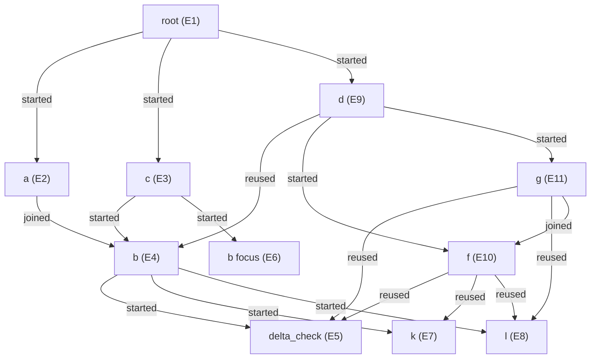

# Scenario A: prompt and executed graph

**Offline scripted fixture.** These are actual Deep Agents/QuickJS calls and supervisor events. PTC fragments are prewritten and selected from observed results; this is not evidence of live-model code generation.

Reproduce: `python demo.py --offline --case a --trace outputs/scenario_a.json`.

Regenerate both documents: `python -m examples.export_trajectories`.

Outcome: `complete`. **26 calls, 18 executions**, 2 in-flight joins, 6 completed-result reuses. 54 scripted model operations; zero model API calls. All acquired leases were released; no active wait edges remain.

## Prompt

Source: [scenario_a.md](../prompts/scenario_a.md).

Investigate the synthetic snapshot using the root skill. Run the baseline view a
and capacity view c concurrently, respecting their evidence-requirement flags.
Both may need b's neutral snapshot evidence: use the same explicit producer task,
projected inputs and session reuse, while keeping their interpretations distinct.
Observe b's accepted measurement checkpoint while it runs. If c needs a
capacity-specific aspect, invoke b with a new task and that checkpoint as evidence.
After they finish, run d's supply cross-check. Follow its links into supplier and
inventory analyses when warranted, including shared f, k and l work. Inspect actual
results, run fresh independent audits, and synthesize only if the checks pass.
Write PTC incrementally from the skill prose and observations.

Bound synthetic inputs:

```json
{
  "sequence_baseline": false,
  "baseline_requires_snapshot": true,
  "capacity_requires_snapshot": true,
  "current": 105,
  "previous": 100,
  "units": {},
  "observations": {
    "a": "Source evidence supports the baseline claim.",
    "b": "Demand is accelerating while supply remains constrained.",
    "c": "Capacity additions lag demand.",
    "d": "Concentrated supplier exposure warrants further investigation.",
    "f": "Alternative suppliers require lead time.",
    "g": "Inventory limits near-term exposure.",
    "h": "A pending regulatory change warrants investigation.",
    "i": "The proposed rule takes effect next quarter.",
    "k": "Volume increased in the supplied snapshot.",
    "l": "Mix is stable in the supplied snapshot."
  }
}
```

The [root procedure](../../skills/root/SKILL.md) and shared [execution prompt](../../harness/runners/node_agent.md) also enter the initial context. The fixture supports these documented scenarios, not arbitrary prompt paraphrases.

## Executed investigation graph

Each vertex is one actual execution. Edges come from `call_acquired` events, including joins and completed-result reuse. First arrival can be either parallel branch. Audit/synthesis vertices are omitted from this diagram and included in the complete tables below.



## Executions

Each row has one context and one produced result. `origin` in the raw trace records who first caused creation; it does not give that caller exclusive ownership.

| Execution | Task | Executor | Input refs |
| --- | --- | --- | --- |
| `E1:root` | Prompt above | `agent` | None |
| `E2:a` | Interpret baseline assumptions | `agent` | None |
| `E3:c` | Interpret capacity and the policy outlook | `agent` | None |
| `E4:b` | Produce snapshot evidence | `agent` | None |
| `E5:delta_check` | Compute snapshot difference | `snapshot_math` | None |
| `E6:b` | Assess capacity from snapshot checkpoint | `agent` | `E4:b/checkpoint:1` |
| `E7:k` | Report volume evidence | `agent` | `E5:delta_check/result` |
| `E8:l` | Report mix evidence | `agent` | `E5:delta_check/result` |
| `E9:d` | Cross-check supply against the completed views | `agent` | `E2:a/result`, `E3:c/result` |
| `E10:f` | Assess supplier alternatives | `agent` | `E4:b/result` |
| `E11:g` | Interpret inventory protection with supplier alternatives | `agent` | `E4:b/result` |
| `E12:artifact_coherence` | Audit this artifact | `agent` | `E2:a/result` |
| `E13:artifact_coherence` | Audit this artifact | `agent` | `E3:c/result` |
| `E14:artifact_coherence` | Audit this artifact | `agent` | `E9:d/result` |
| `E15:artifact_coherence` | Audit joint coherence | `agent` | `E2:a/result`, `E3:c/result`, `E9:d/result` |
| `E16:red_team` | Challenge candidate E2:a/result | `agent` | `E2:a/result` |
| `E17:thesis` | Synthesize the independently interpreted views and audit findings | `agent` | `E2:a/result`, `E3:c/result`, `E9:d/result`, `E12:artifact_coherence/result`, `E13:artifact_coherence/result`, `E14:artifact_coherence/result`, `E15:artifact_coherence/result`, `E16:red_team/result` |
| `E18:red_team` | Review candidate E17:thesis/draft; independently test claims. Return content with candidate_ref, verdict pass/fail/inconclusive, and findings array. | `agent` | `E17:thesis/draft`, `E2:a/result`, `E3:c/result`, `E9:d/result`, `E12:artifact_coherence/result`, `E13:artifact_coherence/result`, `E14:artifact_coherence/result`, `E15:artifact_coherence/result`, `E16:red_team/result` |

## Calls and ownership

Every successful acquisition has its own lease. Multiple rows can target the same execution. A pending observation adds a temporary wait edge. The runtime releases each lease on completion, close, error or cancellation; callers never lock/unlock a skill themselves.

| Caller | Target execution | Caller key | Dispatch | Reuse policy |
| --- | --- | --- | --- | --- |
| `launcher` | `E1:root` | `root` | started | fresh |
| `E1:root` | `E2:a` | `a:1` | started | fresh |
| `E1:root` | `E3:c` | `c:2` | started | fresh |
| `E3:c` | `E4:b` | `b:1` | started | session |
| `E2:a` | `E4:b` | `b:1` | joined | session |
| `E4:b` | `E5:delta_check` | `delta_check:1` | started | session |
| `E3:c` | `E6:b` | `b:2` | started | fresh |
| `E4:b` | `E7:k` | `k:2` | started | session |
| `E4:b` | `E8:l` | `l:3` | started | session |
| `E1:root` | `E9:d` | `d:3` | started | fresh |
| `E9:d` | `E4:b` | `b:1` | reused | session |
| `E9:d` | `E10:f` | `f:2` | started | session |
| `E9:d` | `E11:g` | `g:3` | started | fresh |
| `E11:g` | `E5:delta_check` | `delta_check:1` | reused | session |
| `E10:f` | `E5:delta_check` | `delta_check:1` | reused | session |
| `E11:g` | `E8:l` | `l:2` | reused | session |
| `E11:g` | `E10:f` | `f:3` | joined | session |
| `E10:f` | `E7:k` | `k:2` | reused | session |
| `E10:f` | `E8:l` | `l:3` | reused | session |
| `E1:root` | `E12:artifact_coherence` | `artifact_coherence:4` | started | fresh |
| `E1:root` | `E13:artifact_coherence` | `artifact_coherence:5` | started | fresh |
| `E1:root` | `E14:artifact_coherence` | `artifact_coherence:6` | started | fresh |
| `E1:root` | `E15:artifact_coherence` | `artifact_coherence:7` | started | fresh |
| `E1:root` | `E16:red_team` | `red_team:8` | started | fresh |
| `E1:root` | `E17:thesis` | `thesis:9` | started | fresh |
| `E17:thesis` | `E18:red_team` | `review:0:red_team` | started | fresh |

## Checkpoints and observation order

Each row is an accepted, immutable checkpoint from a producer. The reads are observed grants, ordered by the session event log; 'before final' means the consumer obtained it while the producer was still running. A late subscriber can replay the same checkpoint after completion.

| Producer | Checkpoint | Subscriber reads |
| --- | --- | --- |
| `E4:b` | `E4:b/checkpoint:1` (cursor 1) | `E3:c` (before final), `E2:a` (before final), `E6:b` (before final) |

## Captured PTC and observations

The shared-request fixture helper is shown once. It encodes the standard producer tasks described in skill prose. Consumer interpretations are separate a/c/d/f/g outputs. Live agents write their own equivalent requests.

```js
async function run(node, refs = [], task = 'Interpret the supplied evidence', reuse = 'fresh', inputs = input) {
  const receipt = await tools.runNode({request: {
    node, task, inputs, refs, reuse, key: node + ':' + (++sequence)
  }});
  if (receipt.status !== 'accepted') throw new Error(node + ': ' + receipt.status);
  return receipt;
}

function sharedInputs() {
  return {
    current: input.current, previous: input.previous,
    observations: input.observations, units: input.units
  };
}

// These exact neutral tasks also appear in each producer's prose. Consumer
// interpretation stays in a/c/d/f/g; it is not smuggled into shared work identity.
var sharedTasks = {
  b: 'Produce snapshot evidence',
  delta_check: 'Compute snapshot difference',
  k: 'Report volume evidence',
  l: 'Report mix evidence',
  f: 'Assess supplier alternatives'
};
async function share(node, refs = []) {
  return run(node, refs, sharedTasks[node], 'session', sharedInputs());
}
async function openShared(node, refs = []) {
  return tools.openNode({request: {
    node, task: sharedTasks[node], inputs: sharedInputs(), refs,
    reuse: 'session', key: node + ':' + (++sequence)
  }});
}
async function nextCheckpoint(handle, after = 0) {
  const event = await tools.nextNodeEvent({handle, after});
  if (event.kind !== 'checkpoint' || event.receipt.status !== 'accepted') {
    throw new Error('Expected an accepted checkpoint');
  }
  return event;
}
async function complete(handle, after) {
  let event = await tools.nextNodeEvent({handle, after});
  while (event.kind === 'checkpoint') {
    event = await tools.nextNodeEvent({handle, after: event.cursor});
  }
  if (event.kind !== 'complete' || event.receipt.status !== 'accepted') {
    throw new Error('Node did not complete with an accepted result');
  }
  return event.receipt;
}
```

The following cells cover every composite investigation execution. Full leaf and reviewer actions remain in the JSON trace. IDs are relabeled; repeated first-cell bindings (`input`, `suppliedRefs`, `assignedTask`) and [helper definitions](../ptc_helpers.js) are omitted. Other code and tool observations are copied from execution. Output capture is bounded to 16,000 characters. Cells preserve order within each execution; they are not a global serial schedule or hidden model reasoning.

### E1:root

```js
var rootPrivate = 'not inherited by reviewers';

const [a, c] = await Promise.all([
  run('a', [], 'Interpret baseline assumptions'),
  run('c', [], 'Interpret capacity and the policy outlook')
]);

var state = {a, c, artifacts: [{name: 'a', receipt: a}, {name: 'c', receipt: c}]};
observe('views', await Promise.all([read(a.ref), read(c.ref)]));
```

Observed:

```text
<stdout>
OBS:{"stage":"views","value":[{"checkpoint":"E4:b/checkpoint:1","scope":"Interpret baseline assumptions","snapshot":"E4:b/result","source":"synthetic/a","subchecks":[{"delta":5,"source":"synthetic snapshot pair","text":"Snapshot measurement","unit":"USD"},{"changed":true,"internal":["k","l"],"scope":"Produce snapshot evidence","source":"synthetic/b","subchecks":[{"evidence_count":1,"scope":"Report volume evidence","source":"synthetic/k","text":"Volume increased in the supplied snapshot.","unit":"USD"},{"evidence_count":1,"scope":"Report mix evidence","source":"synthetic/l","text":"Mix is stable in the supplied snapshot.","unit":"USD"}],"text":"Demand is accelerating while supply remains constrained.","unit":"USD"}],"text":"Source evidence supports the baseline claim.","unit":"USD"},{"checkpoint":"E4:b/checkpoint:1","focus":"E6:b/result","policy":null,"scope":"Interpret capacity and the policy outlook","snapshot":"E4:b/result","source":"synthetic/c","subchecks":[{"delta":5,"source":"synthetic snapshot pair","text":"Snapshot measurement","unit":"USD"},{"checkpoint":"E4:b/checkpoint:1","delta":5,"scope":"Assess capacity from snapshot checkpoint","source":"synthetic/b:capacity","text":"Capacity additions lag demand.","unit":"USD"},{"changed":true,"internal":["k","l"],"scope":"Produce snapshot evidence","source":"synthetic/b","subchecks":[{"evidence_count":1,"scope":"Report volume evidence","source":"synthetic/k","text":"Volume increased in the supplied snapshot.","unit":"USD"},{"evidence_count":1,"scope":"Report mix evidence","source":"synthetic/l","text":"Mix is stable in the supplied snapshot.","unit":"USD"}],"text":"Demand is accelerating while supply remains constrained.","unit":"USD"}],"text":"Capacity additions lag demand.","unit":"USD"}]}
</stdout>
<result>null</result>
```

```js
const d = await run('d', [state.a.ref, state.c.ref], 'Cross-check supply against the completed views');
state.artifacts.push({name: 'd', receipt: d});
var completedViews = await Promise.all(state.artifacts.map(item => read(item.receipt.ref)));
state.snapshots = completedViews.map(view => view.snapshot).filter(Boolean);
state.audits = await Promise.all([
  ...state.artifacts.map(item => run('artifact_coherence', [item.receipt.ref], 'Audit this artifact')),
  run('artifact_coherence', state.artifacts.map(item => item.receipt.ref), 'Audit joint coherence'),
  run('red_team', [state.a.ref], 'Challenge candidate ' + state.a.ref)
]);
observe('audits', await Promise.all(state.audits.map(audit => read(audit.ref))));
```

Observed:

```text
<stdout>
OBS:{"stage":"audits","value":[{"coverage":1,"findings":[],"targets":["E2:a/result"],"verdict":"pass"},{"coverage":1,"findings":[],"targets":["E3:c/result"],"verdict":"pass"},{"coverage":1,"findings":[],"targets":["E9:d/result"],"verdict":"pass"},{"coverage":3,"findings":[],"targets":["E2:a/result","E3:c/result","E9:d/result"],"verdict":"pass"},{"candidate_ref":"E2:a/result","findings":[],"verdict":"pass"}]}
</stdout>
<result>null</result>
```

```js
const evidence = [...state.artifacts.map(item => item.receipt.ref), ...state.audits.map(audit => audit.ref)];
const thesis = await run('thesis', evidence, 'Synthesize the independently interpreted views and audit findings');
await tools.submitCandidate({
  summary: 'Completed graph investigation with a reviewed thesis',
  content: {
    outcome: 'complete', thesis: thesis.ref,
    views: state.artifacts.map(item => ({node: item.name, ref: item.receipt.ref})),
    snapshot_refs: state.snapshots, audited: state.artifacts.map(item => item.receipt.ref)
  },
  based_on: [thesis.ref, ...evidence]
});
```

Observed:

```text
<result>{staged: true}</result>
```

### E2:a

```js
const opened = input.baseline_requires_snapshot ? await openShared('b') : null;
const progress = opened ? await nextCheckpoint(opened.handle) : null;
const measured = progress ? await read(progress.receipt.ref) : null;
const b = opened ? await complete(opened.handle, progress.cursor) : null;
var evidenceRefs = [...suppliedRefs,
  ...(progress ? [progress.receipt.ref] : []), ...(b ? [b.ref] : [])];
var observation = evidence('a', {
  snapshot: b?.ref || null, checkpoint: progress?.receipt.ref || null,
  subchecks: b ? [measured, await read(b.ref)] : []
});
observe('evidence', observation);
```

Observed:

```text
<stdout>
OBS:{"stage":"evidence","value":{"text":"Source evidence supports the baseline claim.","unit":"USD","source":"synthetic/a","scope":"Interpret baseline assumptions","snapshot":"E4:b/result","checkpoint":"E4:b/checkpoint:1","subchecks":[{"delta":5,"source":"synthetic snapshot pair","text":"Snapshot measurement","unit":"USD"},{"changed":true,"internal":["k","l"],"scope":"Produce snapshot evidence","source":"synthetic/b","subchecks":[{"evidence_count":1,"scope":"Report volume evidence","source":"synthetic/k","text":"Volume increased in the supplied snapshot.","unit":"USD"},{"evidence_count":1,"scope":"Report mix evidence","source":"synthetic/l","text":"Mix is stable in the supplied snapshot.","unit":"USD"}],"text":"Demand is accelerating while supply remains constrained.","unit":"USD"}]}}
</stdout>
<result>null</result>
```

```js
await tools.submitCandidate({
  summary: 'Evidence interpreted for this question', content: observation, based_on: evidenceRefs
});
```

Observed:

```text
<result>{staged: true}</result>
```

### E3:c

```js
var opened = await openShared('b');
var progress = await nextCheckpoint(opened.handle);
var measured = await read(progress.receipt.ref);
var focused = await run('b', [progress.receipt.ref],
  'Assess capacity from snapshot checkpoint', 'fresh', sharedInputs());
var snapshot = await complete(opened.handle, progress.cursor);
observe('capacity_snapshot', {
  snapshot: await read(snapshot.ref), focus: await read(focused.ref), checkpoint: measured
});
```

Observed:

```text
<stdout>
OBS:{"stage":"capacity_snapshot","value":{"snapshot":{"changed":true,"internal":["k","l"],"scope":"Produce snapshot evidence","source":"synthetic/b","subchecks":[{"evidence_count":1,"scope":"Report volume evidence","source":"synthetic/k","text":"Volume increased in the supplied snapshot.","unit":"USD"},{"evidence_count":1,"scope":"Report mix evidence","source":"synthetic/l","text":"Mix is stable in the supplied snapshot.","unit":"USD"}],"text":"Demand is accelerating while supply remains constrained.","unit":"USD"},"focus":{"checkpoint":"E4:b/checkpoint:1","delta":5,"scope":"Assess capacity from snapshot checkpoint","source":"synthetic/b:capacity","text":"Capacity additions lag demand.","unit":"USD"},"checkpoint":{"delta":5,"source":"synthetic snapshot pair","text":"Snapshot measurement","unit":"USD"}}}
</stdout>
<result>null</result>
```

```js
const policy = null;
var evidenceRefs = [...suppliedRefs, progress.receipt.ref, focused.ref, snapshot.ref,
  ...(policy ? [policy.ref] : [])];
var observation = evidence('c', {
  snapshot: snapshot.ref, checkpoint: progress.receipt.ref,
  focus: focused.ref, policy: policy?.ref || null,
  subchecks: [measured, await read(focused.ref), await read(snapshot.ref),
    ...(policy ? [await read(policy.ref)] : [])]
});
observe('evidence', observation);
```

Observed:

```text
<stdout>
OBS:{"stage":"evidence","value":{"text":"Capacity additions lag demand.","unit":"USD","source":"synthetic/c","scope":"Interpret capacity and the policy outlook","snapshot":"E4:b/result","checkpoint":"E4:b/checkpoint:1","focus":"E6:b/result","policy":null,"subchecks":[{"delta":5,"source":"synthetic snapshot pair","text":"Snapshot measurement","unit":"USD"},{"checkpoint":"E4:b/checkpoint:1","delta":5,"scope":"Assess capacity from snapshot checkpoint","source":"synthetic/b:capacity","text":"Capacity additions lag demand.","unit":"USD"},{"changed":true,"internal":["k","l"],"scope":"Produce snapshot evidence","source":"synthetic/b","subchecks":[{"evidence_count":1,"scope":"Report volume evidence","source":"synthetic/k","text":"Volume increased in the supplied snapshot.","unit":"USD"},{"evidence_count":1,"scope":"Report mix evidence","source":"synthetic/l","text":"Mix is stable in the supplied snapshot.","unit":"USD"}],"text":"Demand is accelerating while supply remains constrained.","unit":"USD"}]}}
</stdout>
<result>null</result>
```

```js
await tools.submitCandidate({
  summary: 'Evidence interpreted for this question', content: observation, based_on: evidenceRefs
});
```

Observed:

```text
<result>{staged: true}</result>
```

### E4:b

```js
var delta = await share('delta_check');
var measurement = await read(delta.ref);
var checkpoint = await tools.publishCheckpoint({
  summary: 'Measured snapshot evidence for other interpretations',
  content: {delta: measurement.delta, unit: measurement.unit,
    source: measurement.source, text: 'Snapshot measurement'},
  based_on: [delta.ref]
});
if (checkpoint.status !== 'accepted') throw new Error('Snapshot checkpoint unaccepted');
observe('delta', await read(delta.ref));
```

Observed:

```text
<stdout>
OBS:{"stage":"delta","value":{"delta":5,"source":"synthetic snapshot pair","text":"Computed delta observation","unit":"USD"}}
</stdout>
<result>null</result>
```

```js
const parts = await Promise.all([share('k', [delta.ref]), share('l', [delta.ref])]);
await tools.submitCandidate({
  summary: 'Shared snapshot evidence',
  content: evidence('b', {changed: true, internal: ['k', 'l'],
    subchecks: await Promise.all(parts.map(part => read(part.ref)))}),
  based_on: [checkpoint.ref, delta.ref, ...parts.map(part => part.ref)]
});
```

Observed:

```text
<result>{staged: true}</result>
```

### E6:b

```js
var measured = await read(suppliedRefs[0]);
observe('focused', measured);
```

Observed:

```text
<stdout>
OBS:{"stage":"focused","value":{"delta":5,"source":"synthetic snapshot pair","text":"Snapshot measurement","unit":"USD"}}
</stdout>
<result>null</result>
```

```js
await tools.submitCandidate({
  summary: 'Capacity-specific follow-up on measured evidence',
  content: {text: input.observations.c, unit: measured.unit,
    source: 'synthetic/b:capacity', scope: assignedTask,
    delta: measured.delta, checkpoint: suppliedRefs[0]},
  based_on: suppliedRefs
});
```

Observed:

```text
<result>{staged: true}</result>
```

### E9:d

```js
var views = await Promise.all(suppliedRefs.map(read));
var snapshot = await share('b');
observe('supplier_snapshot', await read(snapshot.ref));
```

Observed:

```text
<stdout>
OBS:{"stage":"supplier_snapshot","value":{"changed":true,"internal":["k","l"],"scope":"Produce snapshot evidence","source":"synthetic/b","subchecks":[{"evidence_count":1,"scope":"Report volume evidence","source":"synthetic/k","text":"Volume increased in the supplied snapshot.","unit":"USD"},{"evidence_count":1,"scope":"Report mix evidence","source":"synthetic/l","text":"Mix is stable in the supplied snapshot.","unit":"USD"}],"text":"Demand is accelerating while supply remains constrained.","unit":"USD"}}
</stdout>
<result>null</result>
```

```js
var parts = await Promise.all([
  share('f', [snapshot.ref]),
  run('g', [snapshot.ref], 'Interpret inventory protection with supplier alternatives')
]);

var evidenceRefs = [...suppliedRefs, snapshot.ref, ...parts.map(part => part.ref)];
var observation = evidence('d', {
  snapshot: snapshot.ref, investigated: parts.length > 0,
  subchecks: await Promise.all(parts.map(part => read(part.ref)))
});
observe('evidence', observation);
```

Observed:

```text
<stdout>
OBS:{"stage":"evidence","value":{"text":"Concentrated supplier exposure warrants further investigation.","unit":"USD","source":"synthetic/d","scope":"Cross-check supply against the completed views","snapshot":"E4:b/result","investigated":true,"subchecks":[{"scope":"Assess supplier alternatives","source":"synthetic/f","subchecks":[{"evidence_count":1,"scope":"Report volume evidence","source":"synthetic/k","text":"Volume increased in the supplied snapshot.","unit":"USD"},{"evidence_count":1,"scope":"Report mix evidence","source":"synthetic/l","text":"Mix is stable in the supplied snapshot.","unit":"USD"}],"text":"Alternative suppliers require lead time.","unit":"USD"},{"scope":"Interpret inventory protection with supplier alternatives","source":"synthetic/g","subchecks":[{"evidence_count":1,"scope":"Report mix evidence","source":"synthetic/l","text":"Mix is stable in the supplied snapshot.","unit":"USD"},{"scope":"Assess supplier alternatives","source":"synthetic/f","subchecks":[{"evidence_count":1,"scope":"Report volume evidence","source":"synthetic/k","text":"Volume increased in the supplied snapshot.","unit":"USD"},{"evidence_count":1,"scope":"Report mix evidence","source":"synthetic/l","text":"Mix is stable in the supplied snapshot.","unit":"USD"}],"text":"Alternative suppliers require lead time.","unit":"USD"}],"text":"Inventory limits near-term exposure.","unit":"USD"}]}}
</stdout>
<result>null</result>
```

```js
await tools.submitCandidate({
  summary: 'Evidence interpreted for this question', content: observation, based_on: evidenceRefs
});
```

Observed:

```text
<result>{staged: true}</result>
```

### E10:f

```js
var suppliedEvidence = await Promise.all(suppliedRefs.map(read));
var delta = await share('delta_check');
var parts = await Promise.all([share('k', [delta.ref]), share('l', [delta.ref])]);
var evidenceRefs = [...suppliedRefs, delta.ref, ...parts.map(part => part.ref)];
var observation = evidence('f', {subchecks: await Promise.all(parts.map(part => read(part.ref)))});
observe('evidence', observation);
```

Observed:

```text
<stdout>
OBS:{"stage":"evidence","value":{"text":"Alternative suppliers require lead time.","unit":"USD","source":"synthetic/f","scope":"Assess supplier alternatives","subchecks":[{"evidence_count":1,"scope":"Report volume evidence","source":"synthetic/k","text":"Volume increased in the supplied snapshot.","unit":"USD"},{"evidence_count":1,"scope":"Report mix evidence","source":"synthetic/l","text":"Mix is stable in the supplied snapshot.","unit":"USD"}]}}
</stdout>
<result>null</result>
```

```js
await tools.submitCandidate({
  summary: 'Evidence interpreted for this question', content: observation, based_on: evidenceRefs
});
```

Observed:

```text
<result>{staged: true}</result>
```

### E11:g

```js
var suppliedEvidence = await Promise.all(suppliedRefs.map(read));
var delta = await share('delta_check');
var parts = await Promise.all([share('l', [delta.ref]), share('f', suppliedRefs)]);
var evidenceRefs = [...suppliedRefs, delta.ref, ...parts.map(part => part.ref)];
var observation = evidence('g', {subchecks: await Promise.all(parts.map(part => read(part.ref)))});
observe('evidence', observation);
```

Observed:

```text
<stdout>
OBS:{"stage":"evidence","value":{"text":"Inventory limits near-term exposure.","unit":"USD","source":"synthetic/g","scope":"Interpret inventory protection with supplier alternatives","subchecks":[{"evidence_count":1,"scope":"Report mix evidence","source":"synthetic/l","text":"Mix is stable in the supplied snapshot.","unit":"USD"},{"scope":"Assess supplier alternatives","source":"synthetic/f","subchecks":[{"evidence_count":1,"scope":"Report volume evidence","source":"synthetic/k","text":"Volume increased in the supplied snapshot.","unit":"USD"},{"evidence_count":1,"scope":"Report mix evidence","source":"synthetic/l","text":"Mix is stable in the supplied snapshot.","unit":"USD"}],"text":"Alternative suppliers require lead time.","unit":"USD"}]}}
</stdout>
<result>null</result>
```

```js
await tools.submitCandidate({
  summary: 'Evidence interpreted for this question', content: observation, based_on: evidenceRefs
});
```

Observed:

```text
<result>{staged: true}</result>
```

## Final output

```json
{
  "audited": [
    "E2:a/result",
    "E3:c/result",
    "E9:d/result"
  ],
  "outcome": "complete",
  "snapshot_refs": [
    "E4:b/result",
    "E4:b/result",
    "E4:b/result"
  ],
  "thesis": "E17:thesis/result",
  "views": [
    {
      "node": "a",
      "ref": "E2:a/result"
    },
    {
      "node": "c",
      "ref": "E3:c/result"
    },
    {
      "node": "d",
      "ref": "E9:d/result"
    }
  ]
}
```

Accepted publication and review verdicts are separate. The thesis's mandatory review targets its frozen candidate in fresh context. Hashes mentioned inside a view do not themselves grant access to those artifacts. These offline outcomes verify execution mechanics, not live-model reasoning quality.
