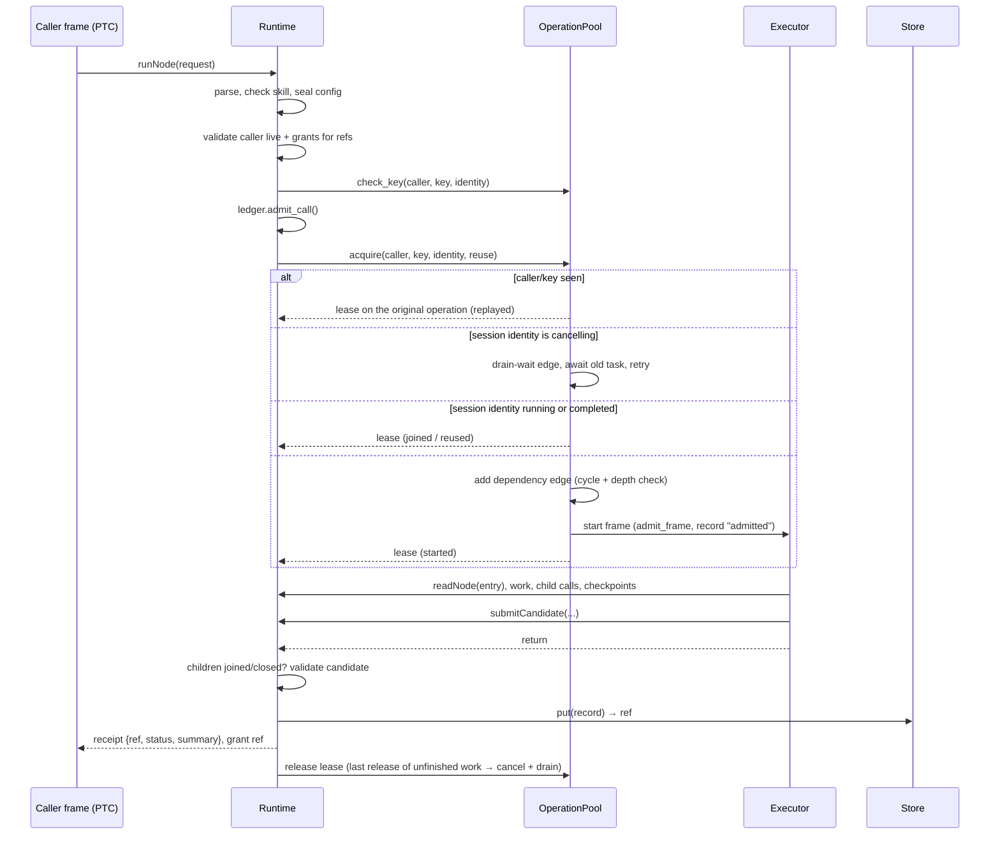
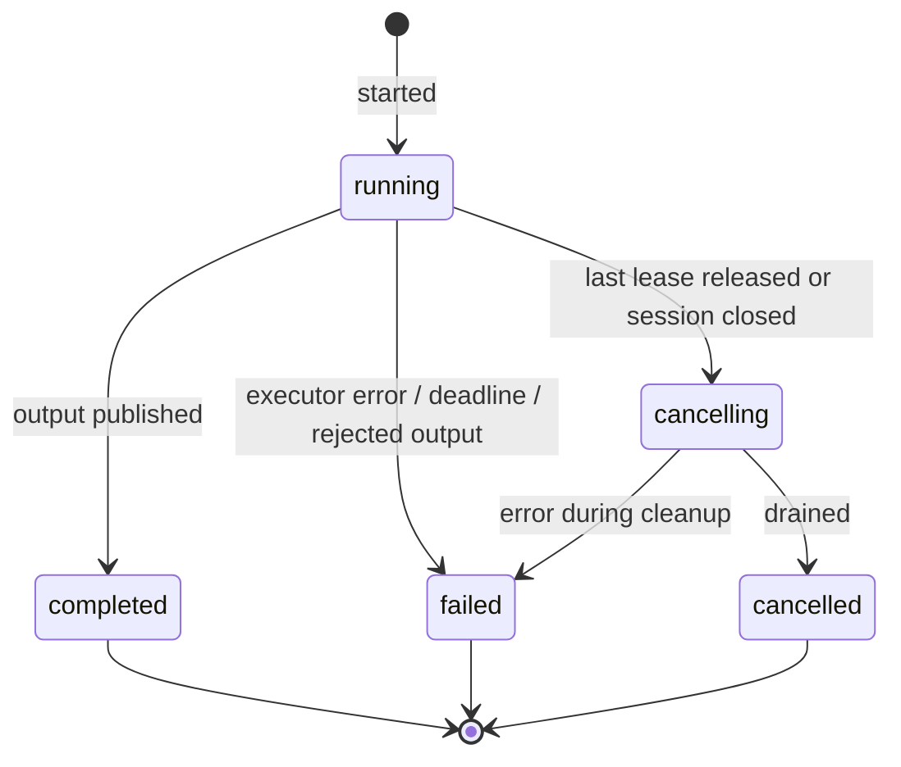
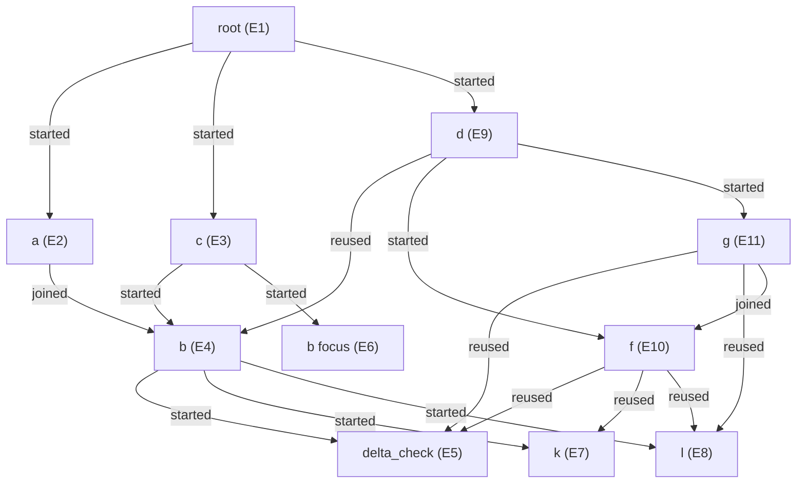

# Callable Skill Graph: Primitives, Implementation, Trajectories and Graph Patterns

This document is the reference for the node runtime in this repository: what the
primitives are, why each one exists, how they are implemented, what executed runs
look like, and how common graph shapes map onto the primitives.

**Baseline.** Commit `7e46345` (`review-fixes`, on top of `40aceff`). 87 tests pass;
the core is about 1,600 lines across `harness/`.

**Status labels used throughout.**

| Label | Meaning |
|---|---|
| **Implemented** | In the code at the baseline commit and covered by tests |
| **Changed in review** | Implemented; semantics changed by `7e46345` (see Appendix A) |
| **Proposed** | Not implemented; a recommended change with its rationale |
| **Open decision** | A trade-off that needs an explicit choice before implementation |

---

## 1. Summary

A **node** is a skill package executed as a function over explicit inputs and
immutable artifacts. The model reads skill prose, observes results and writes
JavaScript programmatic tool calls (PTC) that compose nodes with ordinary code:
functions, `Promise.all`, branches and loops. The host owns only what code cannot
enforce by itself.

```
Skills (prose + links)  ──read──▶  Model writes PTC  ──calls──▶  Host primitives
                                        ▲                             │
                                        └──── receipts / artifacts ◀──┘
```

The runtime owns **execution and artifact authority**. Applications own
**meaning**: verdicts, approval, repair policy and domain schemas are ordinary
artifacts and compositions, never runtime states.

---

## 2. Principles

1. **Prose carries routing.** Which procedure to consult, when to branch, what to
   run in parallel: all of it lives in skill prose and is derived by the model.
2. **Code carries composition.** The model expresses a plan as PTC. Fan-out,
   joins, retries and audits are ordinary JavaScript, not runtime features.
3. **The host carries invariants.** Identity, sharing, grants, lifetimes, budgets
   and provenance must hold every time, so they are enforced by the host.
4. **Explicit over ambient.** A child receives only the task, inputs and refs its
   caller passes. No conversation, private state or implied access is inherited.
5. **Immutable evidence.** Every published output is a content-addressed record.
   Publication says "available", never "correct" or "approved".
6. **Minimal surface.** A capability becomes a primitive only if it passes the
   admission test in §4.1.

---

## 3. Concepts

| Concept | Definition | Where |
|---|---|---|
| **Skill** | A package: `SKILL.md` (frontmatter `name`, `description`; prose body) plus optional resources. Links and revision are derived, never authored. | `harness/skills.py` |
| **Registry snapshot** | Digest of every skill's revision. Pinned for the session. | `Registry.snapshot` |
| **Request** | `{node, task, inputs, key, refs, reuse}`, the whole contract of a call. | `NodeRequest` |
| **Identity** | Digest of the sealed execution config, `node`, `task`, `inputs` and ordered `refs`. Decides sharing. `key` and caller are *not* part of it. | `Runtime._prepare_request` |
| **Operation** | One execution of one identity. Has a task, a state and published checkpoints. | `operations.Operation` |
| **Frame** | The execution context inside an operation: its request, grants, consulted skills, observed refs, children and open handles. | `runtime.Frame` |
| **Lease** | One caller's attachment to an operation. An operation runs while it has leases. | `operations.Lease` |
| **Dependency edge** | `caller → operation`, held by every lease on unfinished work and by drain waits. The edge graph must stay acyclic and depth-bounded. | `OperationPool.waits` |
| **Artifact** | An immutable, content-addressed JSON record: a checkpoint or a final result, with provenance. | `Store`, `Runtime._record` |
| **Grant** | Permission for a frame to read a specific ref. Grants are explicit and non-transitive. | `Frame.grants` |
| **Receipt** | `{ref, status: "published", summary}`, returned for every publication. | `contracts.Receipt` |
| **Executor** | A trusted async function that runs a frame: an agent adapter, a code runner, or an application composition. Bound per skill by the host. | `Runtime.register_executor` |
| **Session** | One runtime instance: one event loop, one ledger, one deadline, one store namespace. | `Runtime` |

---

## 4. Primitives

### 4.1 Admission test

A capability is a host primitive only if **both** hold:

1. The model cannot do it correctly in its own code.
2. Getting it wrong breaks safety, identity, lifetime or provenance.

Everything else is a helper in the PTC prelude or plain model code. By this test,
retries, repair loops, review policies, joins-by-convention and fan-out are *not*
primitives.

### 4.2 Surface today and proposed

Today the model sees eight host capabilities (as `tools.*` and as native tools) plus
the `nodes.*` wrapper installed by the prelude.

| Capability | Today (`tools.*`) | Model-facing proposal | Status |
|---|---|---|---|
| Read a procedure | `readNode({node})` | `nodes.read(name)` | Implemented / rename proposed |
| Final-only call | `runNode({request})` | `nodes.run(request)` | Implemented (wrapper exists) |
| Observed call | `openNode`, `nextNodeEvent`, `closeNode` | `nodes.open(request)` → `{next, checkpoints, result, close}`; raw handle calls hidden | Wrapper implemented; hiding proposed |
| Read an artifact | `readArtifact({ref, offset, limit})` (text slice) | `artifacts.read(ref, path?)` (parsed JSON, size-capped) | Proposed |
| Publish progress | `publishCheckpoint({summary, content, based_on})` | `publish({...})` | Implemented / rename proposed |
| Stage final output | `submitCandidate({summary, content, based_on})` | `submit({...})` | Implemented / rename proposed |
| Domain tools and scripts | none in the agent adapter | `tools.*` registered by the application | Proposed |

**Rationale for hiding raw handle calls.** The prompt currently documents both the
raw handle calls and the wrapper. Two ways to do one thing invites hand-written
cursor loops and overlapping reads. The wrapper already covers every observed-call
pattern (§7).

**Rationale for parsed artifact reads.** Character slices of JSON text are a
leftover from native tool calling, where every result entered the context. In PTC,
code can hold a whole object and print only what it needs, so the host should return
data, not text.

### 4.3 Primitive reference

#### `nodes.read(name)`: read a procedure (Implemented as `readNode`)

Returns `{node, description, revision, text, links, resources}` for the pinned skill.
It records a `node_read` event and adds the node to the frame's `consulted` set. It
does **not** execute anything, publish anything or create obligations.

- Packet limit: 32,000 bytes (skills themselves are capped at 24 KB of prose).
- Links are traversal hints only. They carry no call arguments and no edges.

#### `nodes.run(request)`: final-only call (Implemented)

Starts, joins, reuses or replays the operation for `request`, waits for its final
result and grants **only the final artifact** to the caller. Unobserved checkpoints
are not granted.

Returns a receipt. A failed producer raises its error. A cancelled producer raises
`Rejected("Node work was cancelled…")` and never looks like the caller's own
cancellation (Changed in review, P2).

#### `nodes.open(request)` and the operation object (Implemented)

Acquires a caller-owned lease without waiting. The returned object provides:

| Method | Behavior |
|---|---|
| `next()` | The next checkpoint receipt, or `null` at final completion |
| `checkpoints()` | Async iterator over the remaining checkpoints |
| `result()` | Consumes the remaining events and returns the final receipt |
| `close()` | Releases this caller's lease. Idempotent. Cancels the producer only if no other lease remains |

`nodes.with(request, async op => …)` scopes an observation and always closes in
`finally`. Each observed checkpoint is granted to the caller. Only one read may be
pending per handle. The host releases the handle on terminal delivery.

#### `artifacts.read(ref)`: read evidence (Implemented as `readArtifact`; parsed form proposed)

Reads an authorized record. A frame can read:

- its own records,
- refs passed in its request,
- final results it received,
- checkpoints it observed.

A hash mentioned inside content or `based_on` is **not** a grant. Reads record an
`artifact_read` event and the ref joins the frame's `observed_refs`.

Today's API returns `{ref, text, next_offset, total_chars}` over the JSON-encoded
record, limited to 1–16,000 characters per slice. Until the parsed form lands, use
this helper (verified in QuickJS against a 20 KB artifact):

```js
async function readJSON(ref) {
  let text = '', offset = 0, total = Infinity;
  while (offset < total) {
    const s = await tools.readArtifact({ref, offset, limit: 16000});
    text += s.text; offset = s.next_offset; total = s.total_chars;
  }
  return JSON.parse(text).content;
}
```

#### `publish({summary, content, based_on})`: publish progress (Implemented as `publishCheckpoint`)

Writes an immutable checkpoint record and announces it to current and future
subscribers of this operation, with an ordered cursor. It is allowed only while the
operation is running and not stopping.

- Every `based_on` ref must be authorized for the frame.
- Counts against the session checkpoint budget.
- A checkpoint survives if its producer later fails.

#### `submit({summary, content, based_on})`: stage the final output (Implemented as `submitCandidate`)

Stages the output; the last call wins. The host validates and publishes it when the
executor returns, and only if every child call is joined or closed. Otherwise the
node fails with "Join or close all child calls before returning an output".

Limits:

- `summary`: 1–600 characters,
- `content`: a JSON object,
- `based_on`: authorized, published refs,
- candidate size: 500 KB.

#### `tools.*`: application tools (Proposed)

Domain data, scripts and MCP tools registered by the application and passed through
to PTC. Tool results that are used as evidence should be recorded with `publish` so
that `based_on` can cite them. This is the largest gap for real workflows: without
it, skills can orchestrate each other but cannot touch data.

### 4.4 Request contract and identity

| Field | Type | Meaning | Status |
|---|---|---|---|
| `node` | string | Skill name in the pinned registry | Implemented |
| `task` | string | The question asked of the skill | Implemented |
| `inputs` | object | JSON inputs, detached from the caller at admission | Implemented |
| `refs` | string[] | Ordered artifact grants passed to the child. The caller must already be authorized for each one. | Implemented |
| `key` | string | Caller-scoped idempotency key | Implemented (required). **Proposed:** optional, defaulting to the request identity |
| `reuse` | `fresh` \| `session` | Whether identical requests from other callers may share this execution | Implemented, default `fresh`. **Open decision:** default `session` |

**Identity.**
`digest({execution, node, task, inputs, refs})`, where
`execution = digest({snapshot, bindings, default_executor})`. The encoding is
canonical JSON (sorted keys, no NaN). Requests are capped at 32 KB.

**Caller/key rules.**

- The same caller and key always replays the original operation, including its
  error.
- The same caller and key with a different identity or reuse mode is rejected
  before the call budget is charged (Changed in review, P5).

**Open decision: default `reuse`.** If nodes are treated as functions over
artifacts, memoization (`session`) is the natural default, and independence is
requested explicitly by varying the task or persona or by asking for samples. The
current `fresh` default is safer when a skill's output depends on hidden state such
as time or external data.

### 4.5 Error model (Changed in review, P4)

`quickjs_rs` deliberately sanitizes every host exception to `"Host function failed"`
before it reaches JavaScript. To let generated code self-correct:

- Host capabilities catch `Rejected` at the bridge and return `{rejected: message}`.
- The PTC prelude rethrows that value as a JS `Error` named `Rejected` with the
  original message.
- Only harness-authored `Rejected` messages cross. Other failures stay opaque.
- Native Python callers of `NodeAPI` methods still receive exceptions.

| Typical `Rejected` message | Cause |
|---|---|
| `Unknown skill` | `node` not in the pinned registry |
| `Idempotency key reused for a different request` | Same caller/key, different identity or reuse |
| `Artifact is not visible to this frame; pass an explicit ref` | Missing grant |
| `Dependency cycle: an operation cannot lease work that depends on it` | Lease would close a cycle |
| `Maximum active dependency depth exceeded` | Lease chain longer than `max_depth` |
| `Node work was cancelled before completion; use a new key…` | Replay of a cancelled attempt |
| `Join or close all child calls before returning an output` | Unjoined child or open handle at completion |
| `Session … budget exhausted` / `deadline exceeded` | Ledger limits |

### 4.6 Host-internal capabilities (never model-facing)

| Capability | Responsibility |
|---|---|
| Acquire / release | Atomic start, join, reuse, replay or drain-wait; lease bookkeeping; cancellation of the last-leased producer |
| Dependency graph | Cycle and depth checks on every lease edge |
| Event delivery | Ordered checkpoint cursors; terminal delivery; one pending read per handle |
| Grants | Authorization on every read, every `refs` entry and every `based_on` entry |
| Ledger | Frames, calls, model calls, checkpoints, model parallelism |
| Deadline | One session clock, started at the first call (Changed in review, P6) |
| Executors and bindings | Skill → executor mapping, sealed at the first call |
| Store | Content-addressed records and an ordered event log |

---

## 5. Invariants

These are the properties the host guarantees. Each is covered by tests.

| # | Invariant |
|---|---|
| INV-1 | **Exact sharing.** Two calls share an execution only if their identities are equal and both use `session`. Nothing fuzzy, nothing cross-session. |
| INV-2 | **Sticky keys.** A caller/key pair resolves to one operation forever in the session, including failure. |
| INV-3 | **No ambient authority.** A frame reads only its own records, request refs, received finals and observed checkpoints. Grants are non-transitive. |
| INV-4 | **Immutability.** Published records never change. Refs are SHA-256 of the canonical record and are integrity-checked on read. |
| INV-5 | **Provenance.** Every record carries the session, frame, origin, node and revision, the registry snapshot, the skills consulted, inputs, input refs, observed refs and `based_on`. `based_on` may cite only authorized, published refs. |
| INV-6 | **Structured completion.** A node's output is accepted only after all of its child calls are joined or closed. |
| INV-7 | **Shared lifetime.** An operation runs while any lease holds it. Cancelling one caller cancels its wait, not a producer that another caller still leases. The last release cancels, then drains, the producer. |
| INV-8 | **Acyclic, bounded dependencies.** Every lease on unfinished work is an edge. A new edge that closes a cycle or exceeds `max_depth` is rejected at acquisition (Changed in review, P1/P3). |
| INV-9 | **No overlapping generations.** A replacement for a cancelling shared operation starts only after the old one has drained. |
| INV-10 | **Stopping frames are inert.** Once an operation is stopping, it cannot start work, read procedures or artifacts, or publish. |
| INV-11 | **Replays are honest.** Replaying a cancelled attempt is a request error, never the caller's own cancellation (Changed in review, P2). |
| INV-12 | **Sealed configuration.** Executors and bindings are fixed at the first call and are part of the execution identity. |

---

## 6. Implementation

### 6.1 Module map

| Module | Lines | Responsibility |
|---|---|---|
| `harness/contracts.py` | 97 | `NodeRequest`, candidate validation, canonical encoding, `Rejected` |
| `harness/skills.py` | 169 | Skill packages, link derivation, revisions, registry loading and validation |
| `harness/storage.py` | 55 | SQLite content-addressed records and an ordered event log |
| `harness/operations.py` | 278 | Operation pool: acquisition, leases, dependency graph, checkpoint delivery, draining |
| `harness/runtime.py` | 498 | Frames, grants, the ledger, the deadline, publication, the executor lifecycle |
| `harness/api.py` | 85 | `NodeAPI`: frame-bound capabilities and the bridge encoding for rejections |
| `harness/runners/agent.py` | 133 | Deep Agents adapter (QuickJS code interpreter with PTC) |
| `harness/runners/code.py` | 54 | Direct QuickJS executor for authored JS resources |
| `harness/runners/metering.py` | 43 | Model wrapper that charges the ledger for each inference |
| `harness/runners/ptc.js` | 99 | Prelude: rejection guard and the `nodes` wrapper |
| `harness/runners/node_agent.md` | 62 | The shared execution prompt |

### 6.2 Lifecycle of a call



### 6.3 Operation states



| State at acquisition | `session` request from a new caller | Same caller/key |
|---|---|---|
| none | start | start |
| running | **join** | replay (wait) |
| completed | **reuse** | replay (result) |
| cancelling | drain-wait, then resolve again | replay → `Rejected` |
| failed / cancelled | start a new generation | replay error / `Rejected` |

### 6.4 Dependency graph (Changed in review)

- Every lease on unfinished work adds an edge `caller → operation`. Edges are
  reference-counted and removed on release.
- A drain-wait adds a temporary edge without a lease.
- **Before adding an edge**, the host rejects it if the operation can already reach
  the caller (a cycle), or if any chain would exceed `max_depth` (default 5).
- **Why leases and not just waits.** A parent must join or close its children before
  it completes. A descendant that leases its ancestor can therefore never receive the
  ancestor's final result, and any lease cycle keeps itself alive. Checking leases
  rules out these self-sustaining cycles and also every wait cycle, because a caller
  can only await work it already leases.
- **Consequence.** An open subscription counts toward depth even before its caller
  waits, and mutual subscription is rejected when the second handle opens.

### 6.5 Records and provenance

Each record is canonical JSON, keyed by its SHA-256 hash and capped at 1 MB:

```json
{
  "session": "…", "frame": "…", "origin": "…", "node": "b", "task": "…",
  "executor": "agent", "snapshot": "…", "node_revision": "…",
  "consulted": ["b", "delta_check"], "inputs": {…},
  "input_refs": [], "observed_refs": ["…"],
  "status": "published", "created_at": 1790000000.0,
  "kind": "checkpoint", "checkpoint_sequence": 1,
  "summary": "…", "content": {…}, "based_on": ["…"]
}
```

`kind` and `checkpoint_sequence` are present only on checkpoints. The event log
records:

- **Lifecycle:** `admitted`, `started`, `completed`, `failed`, `cancelled`, `closed`
- **Sharing:** `call_acquired` (with disposition), `call_released`,
  `operation_draining`, `operation_stopping`, `operation_finished`
- **Progress and reads:** `checkpoint_published`, `node_read`, `artifact_read`
- **Adapter observations:** `agent_actions`, `agent_observation`, `code_execution`

### 6.6 Executors and bindings

Bindings map a skill name to an executor name, set by the host and never by
frontmatter. The same request schema works for every executor.

| Executor | Implementation | Used for |
|---|---|---|
| Agent | `DeepAgentRunner`: a fresh Deep Agents graph per frame, a QuickJS interpreter in `thread` mode (state persists across eval cells), PTC capabilities, a 64 MB memory limit, a 64-call PTC limit, 12,000-character results | Prose-driven skills |
| Code | `CodeRunner`: a fresh QuickJS runtime per frame running a pinned JS resource, with the same capabilities and prelude | Deterministic utilities (`delta_check` → `scripts/observe_delta.js`) |
| Composition | Any trusted `async (frame, context) -> candidate`, e.g. `ReviewedTransformation` | Application policy such as draft → review → bounded revision |

The agent's context is three stable packets (the procedure entry, then inputs and
refs, then the task) after the shared system prompt. No parent messages are copied.

**Measured overhead.** The Deep Agents adapter binds 17 tools. Eight of them come
from the framework (`ls`, `read_file`, `write_file`, `edit_file`, `delete`, `glob`,
`grep`, `task`) and account for about 10.3K of the 13.4K schema characters. The
system prompt is about 8.5K characters, of which `node_agent.md` is 4.3K. That makes
a fixed prefix of roughly 5.5K tokens per node, about two-thirds of it framework
(estimated at 4 characters per token).

### 6.7 PTC bridge

- **Prelude injection.** The prelude is injected inline via indirect eval on the
  model's first line, so error stacks keep the model's line numbers. The offset went
  from about 88 lines to 1; the interpreter itself re-prints code one statement per
  line, so exact lines are not achievable.
- **Rejection guard.** It wraps each host capability once per REPL and rethrows
  `{rejected}` values (§4.5).
- **The `nodes` wrapper.** It is installed once per REPL, so operation objects
  survive across eval cells.

### 6.8 Budgets and deadline

| Limit | Default | Enforced at |
|---|---|---|
| `max_calls` | 512 | Admission of every call (after the key check) |
| `max_frames` | 64 | Start of a new execution (joins and reuses are free) |
| `max_model_calls` | 256 | Each inference, via `MeteredModel` |
| `model_parallelism` | 8 | Semaphore held only during inference, never across child waits |
| `max_checkpoints` | 128 | Each `publish` |
| `max_depth` | 5 | Every dependency edge |
| `deadline_seconds` | 180 (demo app: 240) | One session clock from the first call |

These are call-count budgets, not currency or token budgets.

### 6.9 Known limits

- One session, one event loop. Active work is not durable, and there is no crash
  recovery or cross-session cache.
- SQLite persists records and events, but not operations.
- `created_at` is part of the hashed record, so refs are not reproducible across runs.
- The closed-handle map grows for the life of the session.
- Replays count against the call budget.
- A fresh context does not establish independent judgment: the same model with the
  same priors tends to agree with itself.
- Live-model PTC quality, join rate and KV-cache behavior are unmeasured. All
  trajectories below are scripted fixtures.

---

## 7. Graph patterns → primitives

Sketches use today's API: `key` is required and `readJSON` is the helper from §4.3.
Under the proposal, `key` becomes optional and the `tools.*` names shorten; the
shapes do not change. Where a pattern appears in an executed trajectory or a test,
the evidence is cited.

### 7.1 Pipeline

`parse → size → format`, where each step consumes the previous artifact.

```js
const intent = await nodes.run({node: 'intent', task: 'Parse the request', inputs: {text}, key: 'intent'});
const size = await nodes.run({node: 'sizing', task: 'Size the position', inputs: {},
  refs: [intent.ref], key: 'size'});
```

- **Primitives:** `run`, grants through `refs`.
- **Pitfall:** pass every needed ref explicitly. A ref mentioned inside `intent`'s
  content is not a grant for `sizing`.

### 7.2 Fan-out / fan-in

One task per item, then one reducer over all results.

```js
const parts = await Promise.all(names.map(t =>
  nodes.run({node: 'screen', task: 'Screen one name', inputs: {ticker: t}, key: `screen:${t}`})));
const ranked = await nodes.run({node: 'rank', task: 'Rank the screened names', inputs: {},
  refs: parts.map(p => p.ref), key: 'rank'});
```

- **Primitives:** `run`, `refs`. Use `Promise.allSettled` when partial results are
  acceptable.
- **Limits:** `max_frames` (64) and `model_parallelism` (8) bound the width.

### 7.3 Shared trunk (diamond join)

Several parents need the same neutral work; it should run once.

```js
// One canonical builder, used by every parent. Byte-identical requests join.
const snapshotRequest = key => ({node: 'b', task: 'Produce snapshot evidence',
  inputs: {current, previous, observations, units}, refs: [], key, reuse: 'session'});
const snap = await nodes.run(snapshotRequest('b'));
```

- **Primitives:** `run` or `open` with `reuse: 'session'`, plus exact identity.
- **Evidence:** Scenario A. `E2:a` joined `E4:b` while it was running, and `E9:d`
  reused it after completion. Test:
  `test_diamond_starts_once_joins_running_and_reuses_completed_result`.
- **Pitfall:** any caller-specific field in the trunk request silently creates a
  second execution. Put standard tasks in skill prose and build requests with a
  helper, never ad hoc.

### 7.4 Trunk + fork

Share the expensive neutral part, then fork a cheap caller-specific question on the
same skill.

```js
const snap = await nodes.run(snapshotRequest('b'));
const capacity = await nodes.run({node: 'b', task: 'Assess capacity from snapshot checkpoint',
  inputs: {question: 'capacity headroom'}, refs: [snap.ref], key: 'b:capacity'});
```

- **Primitives:** `run` (session trunk, fresh fork), `refs`.
- **Evidence:** Scenario A `E6:b` and Scenario B `E8:b`: the same skill, a different
  task, the trunk's checkpoint as input.
- **Rule:** caller context goes into the fork, never the trunk.

### 7.5 Streaming consumer

Act on a producer's checkpoint while the producer is still running.

```js
let focus, final;
await nodes.with(snapshotRequest('b'), async op => {
  const checkpoint = await op.next();              // receipt, or null if none
  if (checkpoint) focus = await nodes.run({node: 'b',
    task: 'Assess capacity from snapshot checkpoint', inputs: {},
    refs: [checkpoint.ref], key: 'focus'});
  final = await op.result();
});
```

- **Primitives:** `open` (`next`/`result`/`close`), checkpoint grants, `publish` on
  the producer side.
- **Evidence:** Scenario A. `E4:b/checkpoint:1` was read by `E3:c`, `E2:a` and
  `E6:b` before `E4` finished. Test:
  `test_parallel_consumers_reuse_checkpoint_for_different_aspects`.

### 7.6 Conditional branch and early exit

Branch on artifact content, not on receipt status.

```js
const snap = await nodes.run(snapshotRequest('b'));
const {changed} = await readJSON(snap.ref);
if (changed) {
  await Promise.all([nodes.run(volumeRequest('k')), nodes.run(mixRequest('l'))]);
}
```

- **Primitives:** `run`, `artifacts.read`.
- **Evidence:** demo cases `unchanged` and `skip-c` (links that are never followed
  create no calls).

### 7.7 Audit battery

Skills as functions over artifacts: audit each output individually, then jointly.

```js
const views = [a.ref, c.ref, d.ref];
const audits = await Promise.all([
  ...views.map((ref, i) => nodes.run({node: 'artifact_coherence', task: 'Audit this artifact',
    inputs: {}, refs: [ref], key: `coh:${i}`})),
  nodes.run({node: 'artifact_coherence', task: 'Audit joint coherence',
    inputs: {}, refs: views, key: 'coh:joint'}),
]);
const verdicts = await Promise.all(audits.map(r => readJSON(r.ref)));
if (verdicts.some(v => v.verdict !== 'pass')) { /* block or repair */ }
```

- **Primitives:** `run`, `refs` (the auditor sees exactly the granted targets),
  `artifacts.read`.
- **Evidence:** Scenario A `E12`–`E15`. In the `incoherent` case, a failing audit
  blocks the root before synthesis (16 executions, outcome `blocked`).
- **Rule:** a verdict schema belongs in the auditor skill (as a resource) and is
  validated by the application. The runtime never reads `verdict`.

### 7.8 Adversarial red team

Independent challengers against one candidate.

```js
const personas = ['rates bear', 'liquidity skeptic', 'data auditor'];
const attacks = await Promise.all(personas.map(p => nodes.run({node: 'red_team',
  task: `Challenge candidate as a ${p}`, inputs: {persona: p}, refs: [thesis.ref],
  key: `rt:${p}`})));
```

- **Primitives:** `run`, `refs`. Different tasks give independent executions without
  needing `fresh`.
- **Model diversity** is host configuration: bind `red_team` to an executor built
  with a different model factory. Bindings support this today.
- **Evidence:** Scenario A `E16:red_team`. In the `unsupported` case, a failing
  challenge blocks the root.

### 7.9 Generate → critique → bounded repair

Draft, review the exact candidate, and revise with explicit feedback, at most N times.

- **As a composition executor** (recommended for mandatory review):
  `ReviewedTransformation(runtime, "thesis_draft", "red_team", max_revisions=1)`
  is bound to `thesis`. Each revision is a new call with new refs. Approval requires
  the review to name the exact candidate ref, a `pass` verdict and no findings.
- **As PTC** (fine for optional, model-chosen review): the same loop in JS, with
  `key: 'draft:' + n`.
- **Evidence:** Scenario A `E17 → E18 → E19` (approved on the first attempt). Tests:
  `test_revision_is_a_fresh_call_with_explicit_feedback_and_new_review`,
  `test_prior_candidate_review_cannot_approve_revision`,
  `test_failed_check_exhausts_bounded_revisions`.

### 7.10 Recursive decomposition

A node calls its own skill on a narrower subproblem.

```js
if (needsSplit(input)) {
  const halves = await Promise.all(split(input).map((part, i) => nodes.run({node: 'analyze',
    task: 'Analyze this sub-portfolio', inputs: part, key: `sub:${i}`})));
}
```

- **Primitives:** `run`, bounded by `max_depth` on every lease (including unobserved
  `open` handles since P1) and by `max_frames`.
- **Evidence:** `test_real_interpreter_recursive_dispatch_and_submission`,
  `test_open_node_recursion_respects_max_depth`.

### 7.11 Race / speculative execution

Start alternatives, keep the first result, cancel the rest. Verified in QuickJS: the
loser's producer was cancelled and no leases or edges remained.

```js
const ops = await Promise.all(['fast', 'slow'].map(s =>
  nodes.open({node: 'worker', task: 'Solve', inputs: {strategy: s}, key: `race:${s}`})));
const winner = await Promise.any(ops.map(op => op.result()));
await Promise.allSettled(ops.map(op => op.close()));
```

- **Primitives:** `open`, `close` (the last release cancels an unfinished producer).
- **Pitfall:** closing a producer that another caller also leases does not cancel it.

### 7.12 Deterministic step in a prose graph

Callers invoke the skill normally; the host binds it to code.

- **Mechanism:** `bindings={"delta_check": "snapshot_math"}` with
  `CodeRunner(runtime, "scripts/observe_delta.js")`. The skill prose, the request
  schema and callers are unchanged.
- **Evidence:** Scenario A `E5:delta_check` (executor `snapshot_math`), reused by
  `f` and `g`.

### 7.13 Human approval gate (Proposed)

- **Shape:** a node bound to a `human_approval` executor that waits for an external
  decision and publishes it as an artifact.
- **Fits today's primitives:** an executor is any async function.
- **Blocked by:** the single session deadline (180 s by default) and non-durable
  active work. It needs durable sessions or a suspend/resume boundary.

### 7.14 Temporal comparison across sessions (Proposed)

- **Shape:** compare today's run with yesterday's checkpoint.
- **Blocked by:** root requests cannot carry `refs`, and cross-session reads are
  denied.
- **Minimal fix:** *launcher grants*. The application authorizes specific external
  refs when it starts a run; they are recorded in provenance like any other grant.

### 7.15 Anti-patterns

| Anti-pattern | What happens | Instead |
|---|---|---|
| Caller context inside a shared trunk request | The join silently splits into separate executions | Trunk + fork (§7.4) |
| A descendant session-joins its running ancestor | `Rejected: Dependency cycle` | Pass the ancestor's checkpoint down as a ref |
| `nodes.run(...)` without `await`, or `open` without close | The node fails at completion: "Join or close all child calls" | `await`, `nodes.with`, or explicit `close()` |
| Treating `status: "published"` as approval | Unreviewed content flows onward | Read the verdict or decision artifact |
| Using a hash found in content as evidence | `Rejected: not visible to this frame` | The caller passes the ref explicitly |
| Reusing a key for a new attempt | Replays the old result or error | A new key (the proposal adds an explicit attempt nonce) |
| Two concurrent reads on one handle | `Rejected` for the second read | One consumer per handle, or two handles |
| Mandatory review decided only by model-written PTC | The model can skip it | Composition executor or host policy (§10) |

### 7.16 Pattern × primitive matrix

| Pattern | read | run | open | artifacts.read | publish | submit | session reuse | binding |
|---|---|---|---|---|---|---|---|---|
| Pipeline | ● | ● | | ○ | | ● | | |
| Fan-out / fan-in | ● | ● | | ○ | | ● | | |
| Shared trunk | ● | ● | ○ | | ○ | ● | ● | |
| Trunk + fork | ● | ● | ○ | | ● | ● | ● | |
| Streaming consumer | ● | ● | ● | ○ | ● | ● | ○ | |
| Conditional branch | ● | ● | | ● | | ● | | |
| Audit battery | ● | ● | | ● | | ● | | ○ |
| Red team | ● | ● | | ● | | ● | | ○ |
| Bounded repair | ● | ● | | ● | | ● | | ● |
| Recursion | ● | ● | ○ | | | ● | | |
| Race | ● | | ● | ○ | | ● | | |
| Deterministic step | | ● | | | | ● | | ● |

● required ○ optional

---

## 8. Example trajectories

All trajectories are **offline scripted fixtures**. The Deep Agents graphs, QuickJS
interpreters and supervisor events are real; the PTC fragments are prewritten and
selected from observed results. They verify execution behavior, not live-model code
generation or reasoning quality.

Reproduce:

```bash
python demo.py --offline --case a --trace outputs/scenario_a.json
python demo.py --offline --case b --trace outputs/scenario_b.json
python -m examples.export_trajectories   # regenerates examples/trajectories/*.md
```

### 8.1 Scenario A: parallel consumers

The prompt asks for views `a` (baseline) and `c` (capacity) concurrently. Both need
`b`'s neutral snapshot. After them, `d` cross-checks supply. Then come audits and an
approval-gated thesis.

**Outcome:** `complete`. 27 calls, 19 executions, 2 in-flight joins, 6
completed-result reuses. 54 scripted model operations, zero API calls. Every lease
was released and no dependency edges remained.



Audit and synthesis executions (`E12`–`E19`) are omitted from the diagram.

| What happened | Primitive behavior shown |
|---|---|
| `c` started `b`; `a` arrived with the identical request and **joined** the running execution | Exact identity + `session` (INV-1) |
| `b` published `checkpoint:1`; `c`, `a` and `E6` read it **before** `b` finished | Ordered checkpoint delivery; grants on observation |
| `c` asked `b` a different question with the checkpoint as its only ref (`E6`) | Trunk + fork (§7.4) |
| `d` later requested `b` and **reused** the completed result | Completed-result reuse |
| `f` and `g` converged: `g` **joined** the running `f`; both reused `delta_check`, `k` and `l` | Multi-level convergence |
| `delta_check` ran on the `snapshot_math` code executor | Binding (§7.12) |
| Four fresh coherence audits (three single, one joint), then a red team of `a` | Audit battery (§7.7), red team (§7.8) |
| `thesis` (bound to `reviewed_thesis`) ran `thesis_draft`, then `red_team` of that exact draft; approved on attempt 1 | Bounded repair composition (§7.9) |
| The root read the decision and reported `complete` | Approval is an artifact, not a runtime state |

Call ledger excerpt (the full table is in `examples/trajectories/scenario_a.md`):

| Caller | Target | Key | Disposition | Reuse |
|---|---|---|---|---|
| `E3:c` | `E4:b` | `b:1` | started | session |
| `E2:a` | `E4:b` | `b:1` | joined | session |
| `E3:c` | `E6:b` | `b:2` | started | fresh |
| `E9:d` | `E4:b` | `b:1` | reused | session |
| `E11:g` | `E10:f` | `f:3` | joined | session |
| `E17:thesis` | `E18:thesis_draft` | `draft:0` | started | fresh |
| `E17:thesis` | `E19:red_team` | `review:0` | started | fresh |

The key is caller-scoped: `E3:c` and `E2:a` both used `b:1` without conflict, because
sharing depends on identity, not on the key.

### 8.2 Scenario B: baseline first

With `sequence_baseline: true`, `a` completes before `c` starts.

**Outcome:** `complete`. 23 calls, 19 executions, 0 joins, 4 completed-result
reuses, 55 scripted model operations.

- `a` starts `b`, and `b` starts `delta_check`, `k` and `l`.
- `c` then **reuses** the completed `b` rather than joining it, and forks `b` on its
  checkpoint (`E8`, "Assess capacity from snapshot checkpoint").
- `c` follows its policy links into `h` ("Investigate the policy outlook") and `i`
  ("Inspect the proposal timeline"). `h` reuses `delta_check` and `l`.
- `d`, the audits and the thesis composition proceed as in Scenario A.

The same graph produces joins in A and reuses in B. The disposition depends only on
timing, never on how the prose or PTC was written.

### 8.3 Blocked runs

| Case | Defect injected | Outcome |
|---|---|---|
| `incoherent` | Incompatible units and `INCONSISTENT` markers | A coherence audit fails; the root returns `blocked` after 16 executions, and thesis synthesis never runs |
| `unsupported` | An `UNSUPPORTED` claim | The red team fails; the root returns `blocked` after 16 executions |

Both runs publish every artifact, including the failing verdicts. Blocking is the
root's decision, made by reading those verdicts.

### 8.4 What these trajectories do and do not show

| Shown | Not shown |
|---|---|
| Sharing, joins and reuse under real concurrency | Whether a live model writes canonical trunk requests (the join rate) |
| Checkpoint delivery and grants | PTC validity and recovery from `Rejected` in live mode |
| Lease release, cancellation and cleanup | Cost and latency, KV-cache reuse |
| Approval as ordinary composition | Quality of red-team or audit judgments |

**Known artifact.** Rows of concurrent events can reorder between exports, even on
`40aceff`. The edges and dispositions are identical; only the ordering changes.
Sorting in the exporter is on the roadmap.

---

## 9. Skill authoring contract

**Frontmatter (Implemented):** exactly `name` (it must match the package path) and
`description`. Other keys are rejected. Links, revision and resources are derived.

**Proposed:** an optional `owner`, used for review routing, never for runtime behavior.

**Prose should cover:**

1. **How to reason.** The procedure, with `[[links]]` where concepts branch.
2. **Standard tasks.** The exact task strings and input projections that callers
   should use for shareable work, e.g. `b`'s "Produce snapshot evidence". This is
   what makes joins fire.
3. **Expected inputs and refs,** and what to do when one is missing.
4. **Artifact shape.** What goes in `content`, and a `summary` that states the
   conclusion and the binding inputs, not the activity.
5. **Other tasks** the skill answers (forks), e.g. "Assess capacity from snapshot
   checkpoint".

**Resources:**

- scripts bound by the host (e.g. `scripts/observe_delta.js`),
- schemas for artifacts that code consumers parse (verdicts, decisions),
- reference material.

**What does not belong in a skill:** obligations (mandatory review), tool or data
scopes, model choice and executor choice. These are host policy (§10), so skills stay
portable prose.

---

## 10. Host policy

| Policy | Mechanism | Status |
|---|---|---|
| Skill → executor | `bindings`, sealed at the first call and part of the execution identity | Implemented |
| Model per skill (e.g. an adversary on a different model) | An executor per model factory, with the skill bound to it | Implemented (configuration) |
| Must-run-before-release checks | Bind the gated skill to a composition executor (`ReviewedTransformation`) | Implemented |
| Audit that obligations ran | Post-run validator over the event log and records, e.g. every completed `thesis` has a `red_team` whose `input_refs` include its candidate | Proposed |
| Budgets and deadline | `Ledger`, `max_depth`, `deadline_seconds` | Implemented |
| External refs at launch | Launcher grants | Proposed |

**Principle.** A rule the model can skip is not a rule. Mandatory behavior lives in
compositions or in host policy checked against the trace. The model is free to add
extra audits, but it should not be the one deciding whether the mandatory ones run.

---

## 11. Verification

```bash
python -m pip install -r requirements-dev.txt
ruff check . && ruff format --check .
python -m unittest discover -s tests -v          # 87 tests
python demo.py --offline --case a --trace outputs/scenario_a.json
```

Other offline cases: `b`, `deferred`, `skip-c`, `a-diversified`, `b-no-proposal`,
`unchanged`, `incoherent`, `unsupported`.

**Test coverage by area:**

- contracts and skills,
- runtime grants, budgets and deadlines,
- operations (sharing, cancellation, draining, cycles and depth),
- progress (checkpoints, handles, cursors),
- the PTC wrapper in real QuickJS,
- Deep Agents integration,
- the review composition,
- `test_review_regressions.py` (8 tests, each of which fails on `40aceff`).

---

## 12. Gaps and roadmap

| Priority | Item | Why |
|---|---|---|
| P0 | **Application tool passthrough** with evidence recording | Real skills need data and scripts. Without it, the harness cannot run production workflows. |
| P0 | **Live-mode evaluation**: join rate, PTC validity, recovery from `Rejected`, cost per workflow | Every current trajectory is scripted. This decides whether the sharing machinery earns its complexity. |
| P1 | Model-facing surface: hide raw handle calls, parsed `artifacts.read`, optional `key`, a slimmer `node_agent.md` | Less to misuse, and a shorter prefix |
| P1 | Replace `create_deep_agent` with `create_agent` + `CodeInterpreterMiddleware` | About two-thirds of the ~5.5K-token fixed prefix is framework tools and prompt |
| P1 | Launcher grants for prior-session artifacts | Temporal comparison (§7.14) |
| P2 | Post-run policy validator | Auditable obligations (§10) |
| P2 | Durable sessions or suspend/resume | Human gates (§7.13), long workflows |
| P3 | Deterministic trajectory export; `created_at` out of the hashed body; bounded closed-handle map | Reproducibility and hygiene |

**Decision gate.** If live runs show a low join rate even with canonical request
builders, collapse to a thin core: `read`, `run`, `open`, grants, provenance and
`publish`/`submit`, without the shared operation pool. Provenance and grants are the
parts compliance needs. Sharing is an optimization that must prove itself.

---

## Appendix A. Review fixes (`7e46345`)

| # | Defect on `40aceff` | Fix | Regression test |
|---|---|---|---|
| P1 | `max_depth` bypassed through unobserved `open` handles (reached 49 levels with `max_depth=2`) | Every lease on unfinished work holds a dependency edge | `test_open_node_recursion_respects_max_depth` |
| P2 | Replaying a cancelled operation leaked `CancelledError` into the caller; in QuickJS the node died with an uncatchable `DeadlockError` | `settled()` converts the producer's cancellation to `Rejected` | `test_replaying_a_cancelled_operation_does_not_cancel_the_caller`, `test_quickjs_replay_of_cancelled_child_is_catchable` |
| P3 | A descendant session-joining its ancestor kept the ancestor alive after external cancel | The lease-edge cycle check rejects it | `test_external_cancel_is_not_blocked_by_a_descendant_lease` |
| P4 | Every rejection reached JS as `"Host function failed"` | Rejections cross the bridge as values and are rethrown by the prelude | `test_rejection_reasons_reach_javascript`, `test_native_callers_still_receive_exceptions` |
| P5 | Rejected requests (key conflicts) consumed the call budget | Key check before budget admission | `test_rejected_admission_does_not_consume_call_budget` |
| P6 | The session deadline started at construction | It starts at the first call | `test_deadline_starts_at_first_call` |
| — | Prelude shifted model error lines by about 88 | Inline indirect-eval injection (+1 from interpreter re-printing) | Manual probe |

Three existing tests changed because they asserted the old behavior. One expected the
`CancelledError` leak, and two expected open handles and mutual leases to add no
dependency edge.

## Appendix B. Current → proposed names

| Current | Proposed |
|---|---|
| `tools.readNode({node})` | `nodes.read(name)` |
| `tools.runNode({request})` / `nodes.run` | `nodes.run(request)` |
| `tools.openNode` / `nextNodeEvent` / `closeNode` | hidden behind `nodes.open(request)` and `nodes.with(request, fn)` |
| `tools.readArtifact({ref, offset, limit})` | `artifacts.read(ref, path?)` returning parsed JSON |
| `tools.publishCheckpoint({...})` | `publish({...})` |
| `tools.submitCandidate({...})` | `submit({...})` |
| none | `tools.*`: application tools |
